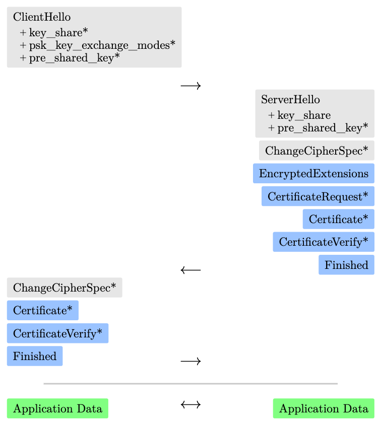

# Implementing TLSv1.3 to Learn Rust and Cryptography

This is the HTML version of my term paper which can be downloaded as PDF
[here](https://github.com/otsmr/AnotherTLS/blob/21dd819d84457801e3f3efbb4013f61ceec07c1c/AnotherTLS.pdf).
The Code from AnotherTLS can be found [here](https://github.com/otsmr/anothertls) and VulnTLS
[here](https://github.com/otsmr/vulntls).

To learn Rust and cryptography at the same time, implementing the Transport Security Layer Protocol
Version 3 (TLSv1.3) can be a very good starting point. As good as any modern cryptography can be
found in the TLSv1.3 stack. This paper provides an overview of some key points to be considered,
especially in terms of security and simplicity. It covers the entire TLSv1.3 stack and shows where
to find the best resources to dive into the cryptographic protocols and some chosen attacks. To be
as close as possible to the practice, the complete TLSv1.3 stack was implemented for this paper. The
implementation can be found on GitHub under the name "AnotherTLS". A vulnerable version "VulnTLS"
can also be found there, where most of the attacks described in this paper can be practically
performed. Based on this implementation, this paper not only conclude that Rust is the best choice
to implement a TLS stack, but also that implementing it can help a lot to understand how modern
protocols and cryptographic works together.

## Introduction

Rust has in recent years gained a lot of popularity among developers due to its performance, safety,
and languages features. According to the "Stack Overflow Developer Survey 2021", Rust is the most
loved programming language [\[stackoverflow\]](#stackoverflow), and this for the fifth year in a
row.

The language is primarily in system programming popular, especially when it comes to networking and
concurrency. Also, big companies adopting the language for low-level code, as for an example Google
announced 2021 in a blog post, that they "feel that Rust is now ready to join C as a practical
language for implementing the kernel" [\[google-rust-kernel\]](#google-rust-kernel). In Android 13,
where "about 21% of all new native code is in Rust" and at the same time "the number of memory
safety vulnerabilities" has decreased.[\[google-rust-android13\]](#google-rust-android13)

Also Cloudflare as a leading CDN uses for the most network traffic handling programs like QUIC or
NTP self developed software written in memory safe language like Rust and Go. Whereby Rust is used
more often in this kind of programs because "a garbage collection pause in the middle of responding
to an NTP packet would negatively impact accuracy" [@quiche; @cloudflare-nts]. And there also
"picked Rust because of its zero-overhead and useful features"
[\[cloudflare-nts\]](#cloudflare-nts).

Even Microsoft Azure CTO Mark Russinovich urged the technology industry to leave C/C++ behind.
"Speaking of languages, it's time to halt starting any new projects in C/C++ and use Rust for those
scenarios where a non-\[garbage collected\] language is required. For the sake of security and
reliability, the industry should declare those languages as deprecated."
[\[microsoft-azure\]](#microsoft-azure)

Because Rust is mostly used in network protocol implementations or low-level code like the Linux
kernel, implementing the TLSv1.3 in Rust can be a good learning resources. TLSv1.3 has become an
essential protocol for secure communication on the internet and is the latest version of the TLS
protocol. It provides significant improvements in security and performance compared to previous
versions.

[\[l_rust\]](#l_rust) introduces Rust and the benefits of using it.
[\[l_tls_handshake\]](#l_tls_handshake) gives an short overview over the RFC8446 and the handshake
of TLSv1.3.  [\[l_tls_stack\]](#l_tls_stack) then covers the TLSv1.3 stack and gives for each member
a short overview and what needs to be considered for security reasons. [\[l_security\]](#l_security)
ends with an overview about the security and what can be done to improve them.

## Rust 
<span id="l_rust"></span>

The Rust Programming Language is a high-level and general-purpose programming language and was start
by a Mozilla employee. The first stable release was in 2015 and has since experienced a huge hype.
The language was adopted by many companies and is the second language with official support for the
Linux kernel.

To start with Rust, the free book "The Rust Programming Language" is a good starting point, to learn
the basic data structures, the ownership system, which makes Rust so safe and much more
[\[rust-lang-book\]](#rust-lang-book). There is also a playlist on YouTube about the book
[\[rust-lang-book-yt-playlist\]](#rust-lang-book-yt-playlist).

On 14 March 2023, Rust was added by the "National Institute of Standards and Technology" (NIST) to
their "Safer Languages" list, because "Rust has an ownership model that guarantees both memory
safety and thread safety, at compile-time, without requiring a garbage collector. This allows users
to write high-performance code while eliminating many bug classes. Though Rust does have an unsafe
mode, its use is explicit, and only a narrow scope of actions is allowed."
[\[rust-nist\]](#rust-nist)

Vulnerabilities like the famous Heartbleed in OpenSSL [\[heartbleed\]](#heartbleed) can never happen
in Rust. If a developer forget a boundary check like in this bug, the program will just panic,
because Rust has a "hidden" boundary check in the `Index` implementation, which "may panic if the
index is out of bounds" [\[just-panic\]](#just-panic). Because a panic terminate the program
immediately, an attacker cannot exploit the vulnerability and the program do not end up in
"undefined behavior" like C code [\[c-undefined-behavior\]](#c-undefined-behavior).

Safety and performance are the most reasons why someone is talking about Rust. But Rust has much
more benefits to offer than safety or performance. A few are introduced by using examples from the
AnotherTLS implementation.

### The ecosystem and Cargo

One of Rust's key strengths is its ecosystem, which offers a wide range of libraries and tools to
help developers to create quickly and efficiently create. At the center of this ecosystem is Cargo,
which is Rust's package manager and build system.

Cargo simplifies the process of building, testing and sharing Rust projects by managing
dependencies, compiling code and automating many common tasks. It also provides a central repository
for Rust packages, known as crates.io, where developers can share their code. There can also easily
add new libraries and tools to their projects, manage multiple versions of dependencies and even
generate documentation for their code. This makes it easy for Rust developers to create, maintain
and distribute software.

### Tests

Tests are usually one of the most annoying things in programming languages - but not in Rust. Where
you store the tests? Which framework should be used? In Rust testing is integrated into Cargo, and
can be started with `cargo test`. The tests can be saved in multiple locations.  For example, at the
end of a file.

``` rs
##[cfg(test)]
mod tests {
 // snip
 #[test]
 fn test_sign_and_verify() {
  // snip
  let sign = ecdsa.sign(&pk, &hash).unwrap();
  assert!(Ecdsa::verify(
   pk.get_public_key(),
   &sign,
   &hashed_message
  ));
 }
}
```

This test is taken from the file `ecdsa.rs` and tests the functionality of the signature creation
process.

### Enums

Enums in Rust are powerful because they allow to define a custom data type that can represent a
fixed set of values, each with its own unique behavior. So in Rust enums can not only do what enums
in C can do, but much more.

In TLS a client sends in his `ClientHello` extensions (see [\[l_tls_handshake\]](#l_tls_handshake)).
So the server has to parse them and store the necessary data. And here Rusts enums can be very
helpful. First we have to define the enum itself, every data type (eg. `KeyShare`) has his own
unique value stored in itself (eg. the `KeyShare` type has an instance of the `KeyShare` struct).

``` rs
enum ClientExtension {
    SupportedVersion(SupportedVersions),
    KeyShare(KeyShare),
    ServerName(ServerName),
    SignatureAlgorithms(SignatureAlgorithms)
}
```

When the server then parses the `ClientHello`, which is stored as `Vec<u8>` in `buf`, he first has
to detect the extension type and the corresponding size.

``` rs
let extension_type = 
 ExtensionType::new(
  to_u16(&buf[consumed..consumed + 2])
 );
consumed += 2;
let size = to_u16(&buf[consumed..consumed + 2]);
```

With this information, the data can then parse with the corresponding parser. And here is the next
reasons why Rusts enums are so powerful.  When handling multiple instances of the enum it can just
stored inside of an array (or in a vec to store it on the heap).

``` rs
let mut extensions: Vec<ClientExtension> = vec![];
// snip
while consumed < buf.len() {
 let extension = match extension_type {
  ExtensionType::ServerName =>
   ClientExtension::ServerName(
    ServerName::parse(
      &buf[consumed..consumed+size]
    )?
   ); // snip
 }
 extensions.push(extension);
 // snip
}
```

When the server then is creating the `ServerHello` he needs all the extensions parsed earlier.
Because all the extensions are stored inside of an array he can just iterate over the array and use
pattern matching (see chapter "18. Patterns and Matching" in [\[rust-lang-book\]](#rust-lang-book))
to get the needed data.

``` rs
for extension in client_hello.extensions.iter() {
 match extension {
  ClientExtension::SupportedVersion(version) => {
   if !version.tls13_is_supported() {
    return Err(TlsError::InsufficientSecurity);
   }
  }
  // snip
}}
```

Also note able is that it is possible to implement functions for enums, which is for example done
for the `AlertLevel` enum.

``` rs
pub enum AlertLevel {
 Warning = 0x01,
 Fatal= 0x02
}
impl AlertLevel {
 pub fn get_from_error (
  desc: TlsError
 ) -> AlertLevel {
  match desc {
    TlsError::CloseNotify => AlertLevel::Warning,
    _ => AlertLevel::Fatal
  }
 }
}
```

When a function now needs the `AlertLevel` from the `TlsError` he can get this by calling the enums
function `get_from_error`.

### The Option Enum

Null references or from his inventor also called "The Billion-Dollar Mistake"
[\[the-billion-dollor-mistake\]](#the-billion-dollor-mistake) exists in most programming languages.
It is a placeholder and means, that this variable has no value. Null references for example used to
indicate, that a pointer is uninitialized. Let's take the following C example.

``` c
int main () {
  char *values = malloc(10);
  free(values);
  int *admin = malloc(1);
  *admin = 0;
  values[0] = 1;
  if (*admin == 1) printf("Hello admin!\n");
  return 0;
}
```

Running this C code will, in the opposite to the developer's expectation print "Hello admin!".

``` sh
$ gcc test.c -o test && ./test
Hello admin!
```

The vulnerability in the code above is called "use after free" and is a common mistake in system
programming languages like C or C++. This vulnerability is for example in the browser "Google
Chrome", which is written in C++, the most common bug
[\[use-after-free-google\]](#use-after-free-google). To prevent exploiting such vulnerabilities, the
developer has to "null reference" the freed value. So after the `free(values)`, the pointer has set
to `NULL` (`values = NULL;`). When then the variable `values` is used, this code will also end up in
`undefined behavior`, but in most implementations such code will result into an access violation and
it can't be exploit by an attacker.

``` sh
$ gcc test.c -o test && ./test
[1]    69283 segmentation fault  ./test
```

In Rust there is no "Null Reference" or "freed value", "but it does have
an enum that can encode the concept of a value being present or absent."
[\[rust-lang-book\]](#rust-lang-book)

The implementation of the C example in Rust would look like this.

``` Rust
fn main() {
 let mut values = Some(vec![]);
 values = None;
 let mut admin = Box::new(0);
 *admin = 0;
 values[0] = 1;
 if *admin == 1 {
   println!("Hello admin!");
 }
}
```

This code would not compile, because of the following error.

``` sh
$ rustc test.rs
error[E0608]: cannot index into a value of type `Option<Vec<_>>`
  --> test.rs:13:3
   |
13 |   values[0] = 1;
   |   ^^^^^^^^^

error: aborting due to previous error
```

The reason is that values is actually an enum from the type `Option<T>`, which is defined as
follows.

``` rs
enum Option<T> {
  Some(T),
  None
}
```

To compile the code, the developer is forced to check whether a value is present or absent, because
only then he can get the value from type `T` out of `Some`.

``` Rust
if let Some(values) = values.as_mut() {
 values[0] = 1;
}
```

### Traits

A trait is a powerful feature which tells the Rust compiler about the functionaliy a type (for
example a struct) must provide. See [\[l_sha2\]](#l_sha2) for an example of how traits can be used.

### Error handling

In most low-level languages the error handling is not part of the language, for example the language
C has no support for error handling at all. Also, the most languages doesn't force the developer to
handle errors, which can lead to unstable code.

In Rust, a developer has the `Result<T, E>` enum. If in a function, an error can happen, for
example, in functions which have IO operations like opening a file, the function returns the
`Result<T, E>` enum. Every function which now calls this function have to handle the error, or and
this is also special in Rust, the error can be propagated. This can save a lot of code and the
developer must always think about the case, that an error can happen.

In AnotherTLS, every function where an error can happen returns `Result<T, TlsError>`. So the error
can always propagate to the top.  Taking the function `TlsStream::handle_client_hello` in
`stream.rs` as an example. This function parses the `ClientHello` and creating the `ServerHello`, so
a lot of sub functions are called, and therefore a lot of errors can happen. The record data has not
the handshake content type, no supported cipher suite is provided by the client, the "server_name"
is wrong, the "key_share" has no supported curves, etc. At the end, each error must reported back to
the client as an alert (see "6. Alert Protocol" [\[tlsv13\]](#tlsv13)). If the client for example
uses TLSv1.2 or lower, AnotherTLS will return with the alert message "protocol_version". The server
can only detect the version of the client from the "supported_versions" extension. This extension is
checked from AnotherTLS in the function `ServerHello::from_client_hello`. If TLSv1.3 is not
supported from the client, this function will return with `Err(TlsError::InsufficientSecurity)` and
is then propagated to `TlsStream::handle_client_hello` with the question mark operator `?`.

``` rs
let server_hello =
 ServerHello::from_client_hello(/*snip*/)?;
```

The error is then propagated to `TlsStream::handle_handshake_record`, then to
`TlsStream::do_handshake` up to the function `TlsStream::do_handshake_block` where the error is
finally handled.

``` rs
if let Err(err) = self.do_handshake() {
 self.write_alert(err)?;
 return Err(err);
}
```

But the developer knows when creating the function `ServerHello::from_client_hello` that the
returned error will be handled, because the compiler will not compile if not (except when using
`unwrap`).

## TLS Protocol Overview 
<span id="l_tls_handshake"></span>

The TLSv1.3 is defined in RFC8446 [\[tlsv13\]](#tlsv13). In this document is described how a server
and a client can create a secure communication channel over a "Transmission Control Protocol" (TCP)
socket. A TLS connection is always initiated from the client, which sends a `ClientHello` to the
server. When implementing the TLS protocol, it is helpful to have every single byte explained, which
can be found on tls13.xargs.org a website from Michael Driscoll
[\[illustrated-tls13-connection\]](#illustrated-tls13-connection).  There not only every byte is
explained, which also can be done with WireShark but also the computation steps for example by the
key derivation step are demonstrated. When debugging the record layer protection in WireShark, it
can be useful to decrypt these using the `keylog` file. In AnotherTLS it is possible to create such
an `keylog` file by enabling this with the `TlsConfigBuilder`, when building the config.

``` rs
let config = TlsConfigBuilder::new()
 .set_keylog_path("./keylog.txt".to_string())
```

This will create a file with the following structure which can be imported by WireShark to decrypt
all protected records. The client random `71f0...` is used to identify the corresponding TLS
connection, because in the `keylog` multiple connection keys can be stored.

``` txt
SERVER_HANDSHAKE_TRAFFIC_SECRET 71f0... e464...dd95
CLIENT_HANDSHAKE_TRAFFIC_SECRET 71f0... 8bef...437f
SERVER_TRAFFIC_SECRET_0 71f0... 3f7e...722a
CLIENT_TRAFFIC_SECRET_0 71f0... 1491...68ea
```

### TLSv1.3 Handshake

The TLS handshake needs at least three TCP packets (represented by the arrow) which holds one or
more TLS records.

<p style="text-align: center"></p>

Each record which is sent during the TLS connection is represented by a box. Gray boxes are
transmitted in plaintext, blue indicate records encrypted using the handshake traffic secret and
green records are encrypted by the application traffic secret. The asterisk (`*`) indicate that this
is optional and may be send. The `ChangeCipherSpec` is only send by legacy reasons, and has in
TLSv1.3 no effect at all.

When implementing the handshake it makes sense to use a state machine, which represents the current
state of the handshake. This is often done by using an enum. The state machine of AnotherTLS can
have the following states.

``` rs
enum HandshakeState {
 ClientHello,
 ClientCertificate,
 ClientCertificateVerify,
 FinishWithError(TlsError),
 Finished,
 Ready,
}
```

## The TLSv1.3 Stack 

TLS consists of other standards also called the TLSv1.3 stack. These are standards that define
various cryptographic operations, hash procedures and file formats. Some of these are required to be
TLS-Compliant, and some can be implemented by TLS implementations. In the following, the required
and implemented standards by AnotherTLS are introduced.

The TLSv1.3 stack has many cryptographic operations. When new to cryptographic, the textbook from
Christoph Paar and Jan Pelzl is a good starting point
[\[understanding-cryptography\]](#understanding-cryptography). He also provides for the book a video
playlist on YouTube for free [\[understanding-cryptography-yt\]](#understanding-cryptography-yt).

When implementing an own TLS version, one should always look at others and how they implement a
secure TLS version. Rustls is perfectly suitable for this purpose. Because Rustls was already
audited, where the testers conclude with "the developers intent to provide a high-quality TLS
implementation is very clear and this goal can be considered as achieved successfully"
[\[rustls-audit\]](#rustls-audit). In Rustls also short manuals can be found, which described how
they realize a secure implementation [\[rusttls-implvulns\]](#rusttls-implvulns).

### SHA2
<span id="l_sha2"></span>

The "Secure Hash Algorithm" (SHA) is a set of cryptographic hash functions. The TLSv1.3 stack
requires SHA-256 and SHA-386 from the SHA-2 family for the key exchange and the authenticity of the
data transmitted between client and server. Both are standardized by the RFC6234 [\[sha2\]](#sha2).

For the best performance, the implementation of the hash algorithm must support transcript hashing.
This term is used in the TLSv1.3 RFC in section "4.4.1 The Transcript Hash" (see page 63 in
[\[tlsv13\]](#tlsv13)). It means, that "implementations can implement the transcript by keeping a
running transcript hash value based on the negotiated hash [\[tlsv13\]](#tlsv13)." The traits in
Rust are best suited to create a flexible but robust implementation for this demand, because the
transcript hashing must be supported by all members of the SHA2 family, like SHA-256 or SHA-386. So
each SHA2 member must implement the following trait.

``` rs
pub trait TranscriptHash {
 fn new() -> Self where Self: Sized;
 fn update(&mut self, buf: &[u8]);
 fn finalize(&mut self) -> Vec<u8>;
 fn get_type(&self) -> HashType;
 fn clone(&self) -> Box<dyn TranscriptHash>;
}
```

Function depending on the `TranscriptHash`, but do not care about the member can now just require
that the `TranscriptHash` must be implemented. The current transcript hash is, for example, required
to create the `CertificateVerify`. On function which has as parameter the current `TranscriptHash` is
in AnotherTLS the function Certificate::`get_certificate_verify_for_handshake`. Because the function
itself does not care about which SHA2 member is required, the function just expects and struct which
implement `TranscriptHash` and then calls its member `finalize`.

``` rs
pub fn get_certificate_verify_for_handshake(
  &self,
  privkey: &PrivateKey,
  tshash: &dyn TranscriptHash,
) -> std::result::Result<Vec<u8>, TlsError> {
  // snip 
 content.extend(tshash.clone().finalize());
  // snip
}
```

### AES

The "Advanced Encryption Standard" (AES) is a FIPS-approved cryptographic algorithm that can be used
to protect electronic data and is standardized with NIST's FIPS 197 publication
[\[fips197\]](#fips197). In the standard are also multiple examples provided at the end to test each
step by the AES.

To understand the AES internals better, the HTML5 animation of Rijndael by Enrique Zabala can help
by showing every computation [\[aes-animation\]](#aes-animation).

### AES-GCM

AES is a block cipher and can by itself only encrypt one block (128 bits) of the cipher's block
length. When data is transmitted using TLS, there are much more data send then just the supported
128 bits.  Therefore, TLSv1.3 needs a "mode of operation". In case of TLSv1.3 this is "the
Galois/Counter Mode of Operation" (GCM) which is defined in [\[aes-gcm\]](#aes-gcm). This mode can
not only encrypt data, but also protect it from changes. What is special about this mode is that it
also protects additional data that is not encrypted, which is called "authenticated encryption with
associated data" (AEAD). In the case of TLSv1.3, these are the five protocol layer header bytes that
are not encrypted during transmission.

The formulas of this mode can be found on page 4 in the section "2.4 Encryption" where also an
easy-to-understand graphic describing the flow of the data proceeded by GCM. At the end, there are
also test vector to test the implementation step by step.

#### Security

The use of a unique IV is in practice as important as the secrecy of the key. When one IV is ever
repeated, the encryption mode is no longer authenticated. Since GCM is a counter mode, the XOR
malleability of the encrypted plaintext becomes a major security issue.
[\[aes-gcm-auth-failed\]](#aes-gcm-auth-failed)

The attack described in the next section is not possible in TLSv1.3, since there are precautions
which preventing the use of repeated IV for AES-GCM encryption. These precautions are described in
section "5.3.  Per-Record Nonce [\[tlsv13\]](#tlsv13)". Here a sequence number is introduced for
each traffic key. Every time a key is used for reading or writing his sequence number is
incremented.

#### Performing a attack with repeated IV

With this attack, the authentication of the ciphertext will be broken.  To understand the attack
easier the graphic on page 5 of [\[aes-gcm\]](#aes-gcm) can be used to understand the formula and
the flow of the GCM. The full attack is described in detail by Antoine Joux in his paper
"Authentication Failures in NIST version of GCM" [\[aes-gcm-auth-failed\]](#aes-gcm-auth-failed).
Below is a summary of the key points of this papers.

The authentication tag `T` is calculated with the following polynomial, where `B1` the first block
of the ciphertext `C1` and $B2$ the second block is. `H` is $E\left( K,0^{127} \right)$ and `L1` is
equal to `len(A1) || len(C1)`. In this example there are no additional data A.  The number behind
the letter eq. `A1` or `L1` means that this belongs to the addition data from the first ciphertext.

$$\ T1\  = \left( \left( \left( (B1\  \ast H) \oplus \ B2 \right) \ast H \right) \oplus \ L1 \right) \ast H) \oplus E\left( K,\text{ IV} \right)$$

This can be reduced to the following polynomial.

$$\ T1\  = \ B1\  \ast H^{3} \oplus \ B2\  \ast H^{2} \oplus \text{ len } \ast H \oplus E\left( K,\text{ IV} \right)$$

Because an attacker doesn't know the key `K` it is impossible to manipulate the ciphertext in such a
way, that the same `auth tag` is the result.

But when the attacker can now obtain access to a second ciphertext `C2` (where the first block is
`D1`), which was encrypted with the same `IV` he can compute `H`, by adding `T1` and `T2` together.
When then adding `T1` and `T2` together $E\left( K,\text{ IV} \right)$ can be removed, because
$E(K,\ Y0) \oplus E\left( K,\text{ IV} \right) = 0$. The polynomial becomes then:

$$\ T1\oplus T2\  = \ (B1\oplus D1)\  \ast H^{3} \oplus \ (B2\oplus D2)\  \ast H^{2} \oplus (L1\oplus L2) \ast H$$

So the attacker learns that `H` is a root of a polynomial he knows. The degree of this polynomial
can be high, since it is equal to the length in blocks of the longer message `M1` and `M2`. But if
the attacker can obtain a second pair of messages with the same `IV` he gets a second polynomial
with root `H`. With these two polynomials he can compute the greatest common divisor and finds a
polynomial of small degree with `H` as root.

When the attacker learns `H` he can compute the keyed hash of any ciphertext he wishes to fake. As
can be seen below.

```txt
Key and IV: [0,0,0,0,0,0,0,0,0,0,0,0,0,0,0,0]
Message: 61646D696E3D30AAAAAAAAAAAAAAAAAA ↵
         BBBBBBBBBBBBBBBBBBBBBBBBBBBBBBBB
Message (ascii): admin=0 (Padding removed)
Ciphertext: c2d646ed27929f167c6a358650374814 ↵
            2834300498e3d86b75b93f9c9946eb8f
Auth Tag: 50784edfdaa395a0e9393d00ccbb0727
Message decrypted: admin=0
```

After obtaining another ciphertext with the same `IV` he can compute `H` and $E\left( K,\text{ IV}
\right)$.

``` txt
H: 0x66e94bd4ef8a2c3b884cfa59ca342b2e
E(K, Y0): 0xe823b7f1a1d3f1a0462ebdb2cae3b350
```

He can then use these to create another ciphertext with the same authentication tag.

```txt
Ciphertext': c2d646ed27929e167c6a358650374814↵
             da741fd8f65b911ea72e96438d1e9c9f
Message' decrypted: admin=1
Auth Tag: 50784edfdaa395a0e9393d00ccbb0727
```

### Elliptic Curve Cryptography 

The "Elliptic Curve Cryptography" (ECC) is a key element for the TLSv1.3 protocol and is used for
the key exchange and in the `CertificateVerify` message, where on peer authenticate it against the
other peer (normally the server authenticates itself to the client).

At the same time, it is also the most time-consuming operation in the handshake. The full handshake
takes in AnotherTLS currently around 90ms (including IO operations like read and write to the
socket) and from these the ECC calculation takes over 45ms. It is therefore of great interest to
optimize these operations.

But first, there are two kinds of curves, which have not only different equations (short Weierstrass
(NIST P-256) and Montgomery (curve25519)) but also used different technics (like clamping by the
curve25519 to ensure time-constant implementations). Therefor an TLS implementation has also two
different ECC multiplications. Which are described in the following section.

#### Implementation

The implementation of the multiplication for curve25519 can be taken from this
[\[ecc-impl-curve25519\]](#ecc-impl-curve25519) paper, which also describes every step to come to
this particular solution.

The implementation of the NIST-P256 is more tricky, because there is at writing no easy to follow
tutorial to find as by the curve25519.  Therefore, the equations for the point, addition and
doubling were implemented and then used by a double and add algorithm for the point multiplication.
The performance was quite bad and also not resisted against timing attacks, as shown later. Another
approach was to look at already existing implementations, which are probability already optimized.
But for no experts, most implementation, for example in the OpenSSL, looking like magic
[\[ecc-openssl-impl\]](#ecc-openssl-impl). But there are also others lightweight implementation, for
example the "ecdsa-python" [\[ecc-starkbank\]](#ecc-starkbank). This implementation uses the
Jacobian curve, which offers faster calculations compared to the Weierstrass curve. The Weierstrass
representation's scalar multiplication took in AnotherTLS around `34ms`, while the Jacobian
representation's scalar multiplication took around `22ms`, making it over `35%` faster.

#### Security 

The security of the TLS server depends on the security of the Elliptic curve implementation. If this
implementation vulnerable, an attacker can compromise the private key or gain access to the shared
secret between the client and the server. At the same time it easy to create an insecure
implementation especially when using curves which have bad ECC security. A good overview over the
different curves and their security can be found on the webpage SafeCurves
[\[ecc-safecurves\]](#ecc-safecurves) by Daniel J. Bernstein and Tanja Lange. As the webpage there
is also an RFC which says, that the X25519, which perform scalar multiplication on the Curve25519
"is designed so that fast, constant-time implementations are easier to produce." The Reference also
gives in chapter five a recommendation for a secure implementation, which is the same as the one
from the tutorial mentioned earlier ([\[ecc-impl-curve25519\]](#ecc-impl-curve25519)).

For the paper "Elliptic Curve Cryptography in Practice" [\[ecc-in-practice\]](#ecc-in-practice), the
authors performed a review of ECC as it is used in practice in order to reveal unique mistakes and
vulnerabilities that arise in implementations of ECC. The most often found vulnerabilities are
summarizes in the following.

##### Insufficient Randomness

The most common mistake was the usage of insufficient randomness. For ECDSA, this can be
catastrophic because it can lead to a full private key recovery, by performing a lattice attack
[\[ecc-minerva\]](#ecc-minerva). See [\[l_randomness\]](#l_randomness) for how to generate secure
random numbers.

##### Timing attack

Implementations of the scalar multiplication can easy lead to timing vulnerabilities. This is for
example described in detail in this [\[ecc-timing-attack\]](#ecc-timing-attack) paper. There, a
timing attack was found in the OpenSSL Montgomery\`s ladder scalar multiplication (see chapter 3.2
in [\[ecc-timing-attack\]](#ecc-timing-attack)) and exploited by collection of a certain amount of
signatures (see chapter 4 in [\[ecc-timing-attack\]](#ecc-timing-attack)). The collected signatures
were then filters to a smaller set of signatures by the measured time. Since the shorter the time,
the higher the probability that there have several leading zeros. With these filtered signatures can
then a lattice attack be mounted to recover the secret key used to generate the signature.

This kind of vulnerability can also be found in the example provided in the Wikipedia article of ECC
point multiplication [\[ecc-timing-wikipedia\]](#ecc-timing-wikipedia). There a Rust example of the
Montgomery ladder can be found. This example has exactly the same vulnerabilities which were found
in the OpenSSL Montgomery\`s ladder implementation. The vulnerably here is, that the author don't
calculate over 256 bit but rather than by the index of the most significant bit
[\[ecc-timing-issue\]](#ecc-timing-issue).

### ECDSA

The "Elliptic Curve Digital Signature Algorithm" (ECDSA) is used to verify the authenticity of
digital messages. It is based on the mathematical properties of elliptic curves and uses a
public-private key pair to generate and verify digital signatures. In TLSv1.3 it is used for the
authenticity of the server and client certificate.

The chapter "5 ECDSA domain parameters" by [\[ecdsa\]](#ecdsa) describes how ECDSA, which is
standardised in "ANSI X9.62-2005 ECDSA", works. To generate a ECDSA signature the following
computation must be made.

**Input**: `Signature(r, s)`, `Message(m)`, `Curve(G, n)`,
`PublicKey(P)`\
**Output**: Boolean

1.  $e = \text{ HASH}(m)$

2.  $w \leftarrow s^{-}1\left( \operatorname{mod}n \right)$

3.  $u_{1} \leftarrow e \ast w\left( \operatorname{mod}n \right)$

4.  $u_{2} \leftarrow r \ast w\left( \operatorname{mod}n \right)$

5.  $(x,y) \leftarrow u_{1} \ast G + u_{2} \ast P$

6.  Return $r = x\left( \operatorname{mod}n \right)$

#### Security

Special attention should also have chapter "8.3 Other attacks" where the importance of the random
nonce is discussed. "The per-message secrets k in ECDSA signature generation have the same security
requirements as the private key d [\[ecdsa\]](#ecdsa)." If an passive attacker E can learn a single
nonce which was used by A to generate a signature, E "can recover A's private key." Also, the use of
the random value is limited to one message (that's why it is also called nonce) "otherwise, the
private key d can be recovered [\[ecdsa\]](#ecdsa)."

Another big mistake is not checking the signature points. This is because if they are zero (or equal
Curve(n)), the signature will always be true.

So if `Signature(s)` is zero (see the previous formulas), `w` is also zero (2). If `w` is zero,
`u_1` and `u_2` are also zero (3 and 4), as are `x` and `y` (5). If then `Signature(r)` is also
zero, a true will be returned in 6, which means that the signature is valid.

This small mistake is catastrophic for an ECDSA implementation. And such simple errors have happened
in the past. For example, this check was not made by Java from version 15 to version 18
[\[ecc-ecdsa-null\]](#ecc-ecdsa-null). Thus, any implementation that depends on the Java
implementation of the ECDSA was vulnerable to this attack.

### ECDH(E) {#l_ecdh}

"Elliptic-curve Diffie--Hellmann" (ECDH) is a key agreement protocol that allows two parties, to
establish a shared secret over an insecure channel. First both parties selecting each a
cryptographic secure random integer $d_{a}$ (Alice) and $d_{b}$ (Bob), which is their private key.
The public keys $Q_{A}$ and $Q_{B}$ are then the result of the multiplication of the private key
with the base point G.  $$Q_{A} = d_{A} \ast G$$ $$Q_{B} = d_{B} \ast G$$

The public key is sent inside the "key_share" extension (section 4.2.8.  Key Share
[\[tlsv13\]](#tlsv13)). Each party can then calculate the shared secret by multiplying the public
key by their own private key.

$$\underset{\text{ shared secret}}{\underbrace{x_{k}}},y_{k} = \left( d_{A} \ast Q_{B} \right) = \left( d_{B} \ast Q_{A} \right))$$

The "key_share" extensions allows different elliptic curves. Because of the security and performance
it is recommended to use X25519 [\[ecdh-state-of-the-art\]](#ecdh-state-of-the-art).

#### Security

As with the ECDSA, the ECDH has parameters that must be checked. The attack "Invalid Curve Attack"
can lead to a full recovery of the private key in older versions of TLS
[\[ecc-invalid-curve\]](#ecc-invalid-curve). With TLSv1.3, perfect forward security was introduced.
Thus, a random number is selected for each key exchange. Therefore, TLSv1.3 uses the term ECDHE and
not just ECDH, where the E stands for "ephemeral".

### HKDF 
<span id="l_hkdf"></span>

HKDF stands for "HMAC-based Extract-and-Expand Key Derivation Function" and is described by the
RFC5869 [\[hkdf\]](#hkdf). In TLSv1.3 this is used in section "7.1. Key Schedule", where the key
derivation process generates multiple keys from two input secrets, which are the pre-shared key (if
not exists 0) and the (EC)DHE shared secret (section 7.4 [\[tlsv13\]](#tlsv13)). The keys are
symmetric keys, which are used to encrypt all records that follow the ServerHello (except
ChangeCipherSpec) as well as the keys to encrypt the application data.  Each key is derived also
from a unique label, like the server handshake traffic secret has the label "s hs traffic" and is
used to encrypt handshake records send by the server.

### HMAC

"Keyed-Hashing for Message Authentication" (HMAC) is described in RFC2104 [\[hmac\]](#hmac). HMAC is
a message authentication mechanism using cryptographic hash functions such as SHA256. In TLSv1.3
this is used by HKDF ([\[l_hkdf\]](#l_hkdf)) to extend existing secrets for the creation of new
keys.

HMAC requires a text as well as a key to generate a hash value for the text, that depends on the
key. As can see below.

**Input**: HASH (H), Text, Key (K), Blocksize (B)\
**Output**: HMAC
$$\text{ ipad } \leftarrow \ the\ byte\ 0x36\ repeated\ B\ times\ $$
$$\text{ opad } \leftarrow \ the\ byte\ 0x5C\ repeated\ B\ times\ $$
$$H\left( K\text{ XOR }\text{ opad }||H\left( \left( K\text{ XOR }\text{ ipad} \right)||\text{ text} \right) \right)$$

If the key is smaller than the block size B, the key is expanded to the
block size by using the hash function.

### X.509

In TLSv1.3, certificates uses the X.509 format. The format is described in RFC3280
[\[RFCx509\]](#RFCx509). The certificate fields are described in section "4.1 Basic Certificate
Fields". An X.509 certificate contains information about the subject (e.g. the FQDN of a website)
and the issuer (usually a certificate authority (CA)). Also included are the public key from the
subject, a serial number with which such a certificate can be revoked, and a signature, usually from
the CA.

#### Implementing

The X.509 certificate is transmitted with the ASN.1 "Distinguished Encoding Rules" (DER) format,
where each element is encoded with a tag, length, and value. A good overview with an explanation of
the individual bytes can be found in this resource [\[x509-parser\]](#x509-parser).

Because the data is deterministic, for example the issuer must always come before the subject, one
approach is to parse the raw data recursive.

```rs
fn parse( 
  res: &mut X509Builder, 
  state: ParsingState,
  data: &[u8], 
  consumed: &mut usize
) -> Result<(), ParseError> {
 let (size, der) = der_parse(consumed, data)?;
 match der {
  DerType::Sequence => {
   let size_should = size + *consumed;
   while size_should > *consumed {
    parse(res, state, data, consumed)?;
   },
  }
  DerType::Integer => {
   let int = Some(bytes::to_ibig_le(body));
   *consumed += size;
   if res.tbs_cert.serial_number.is_none() {
    res.tbs_cert.serial_number = int;
   } else if res.signature.0.is_none() {
    res.signature.0 = int;
   } else {
    res.signature.1 = int;
   }
  } 
  // snip     
 }
}
```

Usually, when parsing such certificates, it can easily lead to memory corruption issues, as each
length field has to be checked. However, due to the safety of Rust, this is not a security problem,
as the program would crash and an attacker could not exploit it.

## Security
<span id="l_security"></span>

When implementing the TLSv1.3 protocol, many security risks must be considered. Each member of the
TLSv1.3 has its own pitfalls which have to be aware of, when implementing as for example the ECDSA
verify function the signature has to check not to be 0. It becomes difficult, when such attacks,
especially side-channel-attacks on elliptic curves are not easy to detect and must be known to the
developer in order to take appropriate countermeasures.

For some member of the stack, some typical vulnerabilities were already introduced and explained.
This section should be a short summary and links to additional papers which and also complements a
vulnerability regarding the randomness. But there are also solutions to harden the security by
looking at the complete implementation for example by using fuzzing.

Fuzzing is often used for C/C++ programs to detect memory corruptions.  But fuzzing can more than
finding such vulnerabilities. It can also detect logic bugs, as for example the `goto` fails in
GnuTLS (`CVE-2014-0092`) or Apple's TLS client (CVE-2014-1266)
[\[implementation-flaws\]](#implementation-flaws). There are already TLS fuzzer which can be used
freely as for example the `tlsfuzzer` [\[tls-fuzzer\]](#tls-fuzzer) or the `TLS-Attacker`
[\[tls-attacker\]](#tls-attacker).

There is also a good summary from known attacks on TLS by the Internet Engineering Task Force. The
summary can be found as RFC7457 [\[tls-security\]](#tls-security).

### Randomness
<span id="l_randomness"></span>

When a TLS peer uses a bad random number generator, the complete connection can be broken from an
attacker. In TLSv1.3 the random number is used in the `ClientServer`, `ServerHello`, the private key
used in the key exchange by ECDHE and for the `CertificateVerify` when using ECDSA. The first random
number generated, will be public through the `Server/ClientRandom`, and the second is then used by
the ECDHE, which is used as shared secret. If this shared secret is known to the attacker, he can
then derive all traffic keys (see "7.1. Key Schedule" [\[tlsv13\]](#tlsv13)). How this mechanism can
be, and has been by the NSA, exploited is described in [\[l_nsa_backdoor\]](#l_nsa_backdoor).

For cryptographic purpose it is always required to use an "cryptographic secure pseudorandom number
generator" (CSPRNG). The choice of the best PRGN can be hard, and sometimes developers come up with
their own PRNGs (eg. page 4 [\[dual_ec_drgb-backdoor\]](#dual_ec_drgb-backdoor)), as for example the
developers of the PRNG from Sonys PlayStation 3. This "PRNG" always returned the same number, which
has lead to a full private key recovery from Sonys private key.

Currently, the AnotherTLS has two PRNGs. The first one, called "SimpleRng" is insecure and only used
for tests. For testing it is useful, when the calculations are deterministic in order to create
hard-coded values to check the result. When random integers are needed for cryptographic purpose the
file `/dev/urandom` is used to generate cryptographic secure random numbers. In the internet often
`/dev/urandom` is called "unsecure" and it should always `/dev/random` be used for cryptographic
purpose. But this is not only wrong but somethings can lead to more insecurity. Because
`/dev/random` can block, e.g. dont generate random values, developers try to create there own PRNG,
which is mostly more insecure. [\[urandom\]](#urandom)

#### Dual_EC 
<span id="l_nsa_backdoor"></span>

When using a PRNG developer usually must trust experts, or use standardized PRNG for example by the
NIST. But even standardized CSPRNG from the NIST (cf. pages 57 and 74
[\[dual_ec_drgb\]](#dual_ec_drgb)) can have a backdoor by the NSA, as the "Dual Elliptic Curve
Deterministic Random Bit Generator" (Dual_EC_DRBG) has shown
[\[dual_ec_drgb-backdoor\]](#dual_ec_drgb-backdoor). Below, a basic implementation of the
Dual_EC_DRBG in Python.

``` py
c = Curve.curveP256()
p, r, b, P = (c.p, c.n, c.b, c.G)
Q = Point(0xc974..., 0xb28e...) # page 74 NIST

s = ecc_mult(entropy_source(), P).x

def dual_ec_drgb():
 global s
 s = ecc_mult(s, P).x
 r = ecc_mult(s, Q).x 
 return r & (0x1<<(256-16))-1
```

The function `ecc_mult`, which provides an ECC point multiplication, is a cryptographically secure
one-way function. It is computationally hard to compute `s` given `sP` and `P`. This is also known
as the "elliptic-curve discrete-logarithm problem" (ECDLP).

The backdoor is described in detail from Daniel J. Bernstein, Tanja Lange and Ruben Niederhagen in
their paper "Dual EC: A Standardized Back Door" [\[dual_ec_drgb-backdoor\]](#dual_ec_drgb-backdoor).
In the following is a short summery from section 5 about the functionality of the backdoor. The
attacker knows a scalar `d` such that $P = d \ast Q$, and seeds the random output $r_{1}$ (e.g. when
$r_{1}$ is used as a public random). He can then compute the `y`-coordinate of the `x`-coordinate
$r_{1}$ using the curve equation and obtain $R = \left( r_{1},y_{r1} \right) = d \ast s_{1}Q =
s_{1}\text{dQ } = s_{1}P$.  With the knowledge of $s_{1}P$ the attacker can now reproduce all the
following Dual_EC output of the victim.

TLS is one practical example where this PRNG can be used by an attacker who knows the secret scalar
$d$ to decrypt all transmitted data (cf.  chapter 6 in
[\[dual_ec_drgb-backdoor\]](#dual_ec_drgb-backdoor)).  In the `Server/ClientHello` are `32` bytes of
public visibly random data material ($x\left( s_{1} \ast Q \right)$). The current state `s` is then
used to generate a random number ($x\left( s_{2} \ast Q \right)$) for the ECDHE (see
[\[l_ecdh\]](#l_ecdh)), which is the private key of the corresponding peer. So the attacker can
compute the state $s_{1}$, when he knows the secret scalar $d$. Knowing the state $s_{1}$ he then
compute $s_{2}$ and therefore the private key and with that the shared secret between the server and
client.

VPN can also backdoored using the Dual_EC algorithm, which has the "Juniper Dual EC Incident" has
shown [\[dual_ec_drgb_juniper\]](#dual_ec_drgb_juniper).

## Conclusion

For this paper the TLSv1.3 protocol was implemented from scratch in Rust, in order to be able to
show as practically as possible what needs to be considered when implementing it, especially in
terms of security.  While implementing the TLSv1.3 stack many security pitfalls must be keep in
mind, to create a secure implementation.

This paper has provided a comprehensive overview about the importance of Rust, its benefits and why
Rust is not only gives memory safety guarantees, but also features to create readable low-level
code. It was also shown why Rust is used by companies like Google and Cloudflare in low-level code
or network protocol implementations, because of its "zero-overhead and useful features."

Beside of learning Rust, one can also learn how modern cryptographic is used and a secure protocol
design looks like. The educational benefit can be improved when, at the same time also known
implementation flaws in older TLS versions be looked at and how they have been fixed in the latest
version. It is also useful to look at the stack members individually, like ECDSA and what attacks
are known on them, that may also compromise the security of TLS, such as timing attacks. To
understand such attacks easier, it is useful to try them out. For this the VulnTLS based on the
AnotherTLS implementation was created, but with artificial vulnerabilities, where for example the
timing attack on ECDSA can be exploited on a running TLS server.


## Bibliography


- [<span id="tlsv13">tlsv13</span>] Internet Engineering Task Force "The Transport Layer Security (TLS) Protocol Version 1.3". [https://tools.ietf.org/html/rfc8446](https://tools.ietf.org/html/rfc8446)
- [<span id="google-rust-android13">google-rust-android13</span>] Jeffrey Vander Stoep "Memory Safe Languages in Android 13". [https://security.googleblog.com/2022/12/memory-safe-languages-in-android-13.html](https://security.googleblog.com/2022/12/memory-safe-languages-in-android-13.html)
- [<span id="microsoft-azure">microsoft-azure</span>] Mark Russinovich "Twitter". [https://twitter.com/markrussinovich/status/1571995117233504257](https://twitter.com/markrussinovich/status/1571995117233504257)
- [<span id="cloudflare-nts">cloudflare-nts</span>] Watson Ladd, Pop Chunhapanya "Announcing cfnts: Cloudflare's implementation of NTS in Rust". [https://blog.cloudflare.com/announcing-cfnts/](https://blog.cloudflare.com/announcing-cfnts/)
- [<span id="quiche">quiche</span>] Cloudflare "quiche". [https://github.com/cloudflare/quiche](https://github.com/cloudflare/quiche)
- [<span id="stackoverflow">stackoverflow</span>] StackOverflow "Developer Survey 2021". [https://insights.stackoverflow.com/survey/2021#most-loved-dreaded-and-wanted-language-love-dread](https://insights.stackoverflow.com/survey/2021#most-loved-dreaded-and-wanted-language-love-dread)
- [<span id="google-rust-kernel">google-rust-kernel</span>] Wedson Almeida Filho, Android Team "Rust in the Linux kernel". [https://security.googleblog.com/2021/04/rust-in-linux-kernel.html](https://security.googleblog.com/2021/04/rust-in-linux-kernel.html)
- [<span id="anothertls">anothertls</span>] Tobias Müller "AnotherTLS". [https://github.com/otsmr/anothertls](https://github.com/otsmr/anothertls)
- [<span id="heartbleed">heartbleed</span>] "The Heartbleed Bug". [https://heartbleed.com/](https://heartbleed.com/)
- [<span id="the-billion-dollor-mistake">the-billion-dollor-mistake</span>] "Null References: The Billion Dollar Mistake". [https://www.infoq.com/presentations/Null-References-The-Billion-Dollar-Mistake-Tony-Hoare/](https://www.infoq.com/presentations/Null-References-The-Billion-Dollar-Mistake-Tony-Hoare/)
- [<span id="rust-lang-book">rust-lang-book</span>] Steve Klabnik, Carol Nichols, with contributions from the Rust Community "The Rust Programming Language". [https://doc.rust-lang.org/book/](https://doc.rust-lang.org/book/)
- [<span id="rust-lang-book-yt-playlist">rust-lang-book-yt-playlist</span>] Let's Get Rusty (YouTube Channel) "The Rust Lang Book". [https://youtu.be/OX9HJsJUDxA](https://youtu.be/OX9HJsJUDxA)
- [<span id="rust-nist">rust-nist</span>] National Institute of Standards and Technology "Safer Languages". [https://www.nist.gov/itl/ssd/software-quality-group/safer-languages](https://www.nist.gov/itl/ssd/software-quality-group/safer-languages)
- [<span id="sha2">sha2</span>] Internet Engineering Task Force "US Secure Hash Algorithms". [https://tools.ietf.org/html/RFC6234](https://tools.ietf.org/html/RFC6234)
- [<span id="fips197">fips197</span>] National Institute of Standards and Technology "Advanced Encryption Standard (AES)". [https://csrc.nist.gov/publications/detail/fips/197/final](https://csrc.nist.gov/publications/detail/fips/197/final)
- [<span id="implementation-flaws">implementation-flaws</span>] Olivier Levillain "Implementation Flaws in TLS Stacks Lessons Learned and Study of TLS 1.3 Benefits". [http://doi.org/10.1007/978-3-030-68887-5_5](http://doi.org/10.1007/978-3-030-68887-5_5)
- [<span id="use-after-free-google">use-after-free-google</span>] Adrian Taylor, Bartek Nowierski, Kentaro Hara "Use-after-freedom: MiraclePtr". [https://security.googleblog.com/2022/09/use-after-freedom-miracleptr.html](https://security.googleblog.com/2022/09/use-after-freedom-miracleptr.html)
- [<span id="aes-gcm">aes-gcm</span>] David A. McGrew, John Viega "The Galois/Counter Mode of Operation (GCM)". [https://luca-giuzzi.unibs.it/corsi/Support/papers-cryptography/gcm-spec.pdf](https://luca-giuzzi.unibs.it/corsi/Support/papers-cryptography/gcm-spec.pdf)
- [<span id="aes-gcm-auth-failed">aes-gcm-auth-failed</span>] Antoine Joux "Authentication Failures in NIST version of GCM". 
- [<span id="aes-animation">aes-animation</span>] Enrique Zabala "HTML5 Animation of Rijndael". [https://formaestudio.com/rijndaelinspector/archivos/Rijndael_Animation_v4_eng-html5.html](https://formaestudio.com/rijndaelinspector/archivos/Rijndael_Animation_v4_eng-html5.html)
- [<span id="ecdsa">ecdsa</span>] Don Johnson, Alfred Menezes, Scott Vanstone "The Elliptic Curve Digital Signature Algorithm (ECDSA)". [https://doi.org/10.1007/s102070100002](https://doi.org/10.1007/s102070100002)
- [<span id="understanding-cryptography">understanding-cryptography</span>] Christof Paar, Jan Pelzl "Understanding Cryptography". [https://doi.org/10.1007/978-3-642-04101-3](https://doi.org/10.1007/978-3-642-04101-3)
- [<span id="understanding-cryptography-yt">understanding-cryptography-yt</span>] Christof Paar "Introduction to Cryptography by Christof Paar". [https://www.youtube.com/channel/UC1usFRN4LCMcfIV7UjHNuQg](https://www.youtube.com/channel/UC1usFRN4LCMcfIV7UjHNuQg)
- [<span id="ecc-timing-attack">ecc-timing-attack</span>] Billy Bob Brumley, Nicola Tuveri "Remote Timing Attacks are Still Practical". [https://eprint.iacr.org/2011/232.pdf](https://eprint.iacr.org/2011/232.pdf)
- [<span id="ecc-timing-wikipedia">ecc-timing-wikipedia</span>] Dustin Ray "Elliptic curve point multiplications". [https://en.wikipedia.org/wiki/Elliptic_curve_point_multiplication](https://en.wikipedia.org/wiki/Elliptic_curve_point_multiplication)
- [<span id="ecc-impl-curve25519">ecc-impl-curve25519</span>] Martin Kleppmann "Implementing Curve25519/X25519: A Tutorial on Elliptic Curve Cryptography". [https://martin.kleppmann.com/papers/curve25519.pdf](https://martin.kleppmann.com/papers/curve25519.pdf)
- [<span id="ecc-in-practice">ecc-in-practice</span>] Joppe W.  Bos, J.  Alex Halderman, Nadia Heninger, Jonathan Moore, Michael Naehrig, Eric Wustrow "Elliptic Curve Cryptography in Practice". [https://eprint.iacr.org/2013/734](https://eprint.iacr.org/2013/734)
- [<span id="ecc-minerva">ecc-minerva</span>] Jan Jancar, Vladimir Sedlacek, Petr Svenda, Marek Sys "Minerva: The curse of ECDSA nonces". [https://eprint.iacr.org/2020/728](https://eprint.iacr.org/2020/728)
- [<span id="ecc-timing-issue">ecc-timing-issue</span>] Tobias Müller "This implementation is vulnerable to a timing attack". [https://github.com/drcapybara/e521-rust/issues/1](https://github.com/drcapybara/e521-rust/issues/1)
- [<span id="ecc-ecdsa-null">ecc-ecdsa-null</span>] Neil Madden "CVE-2022-21449: Psychic Signatures in Java". [https://neilmadden.blog/2022/04/19/psychic-signatures-in-java/](https://neilmadden.blog/2022/04/19/psychic-signatures-in-java/)
- [<span id="ecc-safecurves">ecc-safecurves</span>] Daniel J. Bernstein, Tanja Lange "SafeCurves: choosing safe curves for elliptic-curve cryptography.". [https://safecurves.cr.yp.to](https://safecurves.cr.yp.to)
- [<span id="ecc-openssl-impl">ecc-openssl-impl</span>] OpenSSL "ecp_nistp256.c". [https://github.com/openssl/openssl/blob/master/crypto/ec/ecp_nistp256.c](https://github.com/openssl/openssl/blob/master/crypto/ec/ecp_nistp256.c)
- [<span id="ecc-invalid-curve">ecc-invalid-curve</span>] Tibor Jager, Jörg Schwenk, Juraj Somorovsky "Practical Invalid Curve Attacks on TLS-ECDH". [https://www.nds.rub.de/media/nds/veroeffentlichungen/2015/09/14/main-full.pdf](https://www.nds.rub.de/media/nds/veroeffentlichungen/2015/09/14/main-full.pdf)
- [<span id="ecdh-state-of-the-art">ecdh-state-of-the-art</span>] D. J. Bernstein "A state-of-the-art Diffie-Hellman function". [https://cr.yp.to/ecdh.html](https://cr.yp.to/ecdh.html)
- [<span id="ecc-for-security">ecc-for-security</span>] Internet Research Task Force "Elliptic Curves for Security". [https://datatracker.ietf.org/doc/html/rfc7748](https://datatracker.ietf.org/doc/html/rfc7748)
- [<span id="ecc-starkbank">ecc-starkbank</span>] Starkbank "ecdsa-python". [https://github.com/starkbank/ecdsa-python/](https://github.com/starkbank/ecdsa-python/)
- [<span id="hkdf">hkdf</span>] Internet Engineering Task Force "HMAC-based Extract-and-Expand Key Derivation Function (HKDF)". [https://www.rfc-editor.org/rfc/rfc586/9](https://www.rfc-editor.org/rfc/rfc586/9)
- [<span id="hmac">hmac</span>] Network Working Group "HMAC: Keyed-Hashing for Message Authentication". [https://www.rfc-editor.org/rfc/rfc2104](https://www.rfc-editor.org/rfc/rfc2104)
- [<span id="tls-security">tls-security</span>] Internet Engineering Task Force "Summarizing Known Attacks on Transport Layer Security (TLS) and Datagram TLS (DTLS)". [https://www.rfc-editor.org/rfc/rfc7457](https://www.rfc-editor.org/rfc/rfc7457)
- [<span id="RFCx509">RFCx509</span>] Network Working Group "Internet X.509 Public Key Infrastructure Certificate and Certificate Revocation List (CRL) Profile". [https://www.rfc-editor.org/rfc/rfc3280](https://www.rfc-editor.org/rfc/rfc3280)
- [<span id="x509-parser">x509-parser</span>] Lapo Luchini "JavaScript generic ASN.1 parser". [https://github.com/lapo-luchini/asn1js](https://github.com/lapo-luchini/asn1js)
- [<span id="rustls">rustls</span>] Authors of Rustls "rustls - a modern TLS libary in Rust". [https://github.com/rustls/rustls](https://github.com/rustls/rustls)
- [<span id="rusttls-implvulns">rusttls-implvulns</span>] Authors of Rustls "implvulns.rs". [https://github.com/rustls/rustls/blob/main/rustls/src/manual/implvulns.rs](https://github.com/rustls/rustls/blob/main/rustls/src/manual/implvulns.rs)
- [<span id="rustls-audit">rustls-audit</span>] Cure53, M. Heiderich, N. Krein, N. Kobeissi, G. Kopf "Security Review & Audit Report rustls 05.-06.2020". [https://raw.githubusercontent.com/rustls/rustls/main/audit/TLS-01-report.pdf](https://raw.githubusercontent.com/rustls/rustls/main/audit/TLS-01-report.pdf)
- [<span id="urandom">urandom</span>] Thomas "Myths about /dev/urandom". [https://www.2uo.de/myths-about-urandom/](https://www.2uo.de/myths-about-urandom/)
- [<span id="dual_ec_drgb">dual_ec_drgb</span>] NIST, Elaine Barker, John Kelsey "Recommendation for Random Number Generation Using Deterministic Random Bit Generators (Revised)". [https://nvlpubs.nist.gov/nistpubs/Legacy/SP/nistspecialpublication800-90r.pdf](https://nvlpubs.nist.gov/nistpubs/Legacy/SP/nistspecialpublication800-90r.pdf)
- [<span id="dual_ec_drgb-backdoor">dual_ec_drgb-backdoor</span>] Daniel J. Bernstein, Tanja Lange, Ruben Niederhagen "Dual EC: A Standardized Back Door". [https://www.projectbullrun.org/dual-ec/documents/dual-ec-20150731.pdf](https://www.projectbullrun.org/dual-ec/documents/dual-ec-20150731.pdf)
- [<span id="dual_ec_drgb_juniper">dual_ec_drgb_juniper</span>] Stephen Checkoway, Shaanan Cohney, Christina Garman, Matthew Green, Nadia Heninger, Jacob Maskiewicz, Eric Rescorla, Hovav Shacham, and Ralf-Philipp Weinmann "A Systematic Analysis of the Juniper Dual EC Incident". [https://eprint.iacr.org/2016/376.pdf](https://eprint.iacr.org/2016/376.pdf)
- [<span id="illustrated-tls13-connection">illustrated-tls13-connection</span>] Michael Driscoll "The Illustrated TLS 1.3 Connection". [https://tls13.xargs.org/](https://tls13.xargs.org/)
- [<span id="tls-fuzzer">tls-fuzzer</span>] "tlsfuzzer". [https://github.com/tlsfuzzer/tlsfuzzer](https://github.com/tlsfuzzer/tlsfuzzer)
- [<span id="tls-attacker">tls-attacker</span>] Ruhr University Bochum, Paderborn University, Hackmanit GmbH "TLS-Attacker". [https://github.com/tls-attacker/TLS-Attacker](https://github.com/tls-attacker/TLS-Attacker)
- [<span id="just-panic">just-panic</span>] "Performs the indexing (container[index]) operation.". [https://doc.rust-lang.org/std/ops/trait.Index.html#tymethod.index](https://doc.rust-lang.org/std/ops/trait.Index.html#tymethod.index)
- [<span id="c-undefined-behavior">c-undefined-behavior</span>] "Undefined behavior". [https://en.cppreference.com/w/c/language/behavior](https://en.cppreference.com/w/c/language/behavior)
