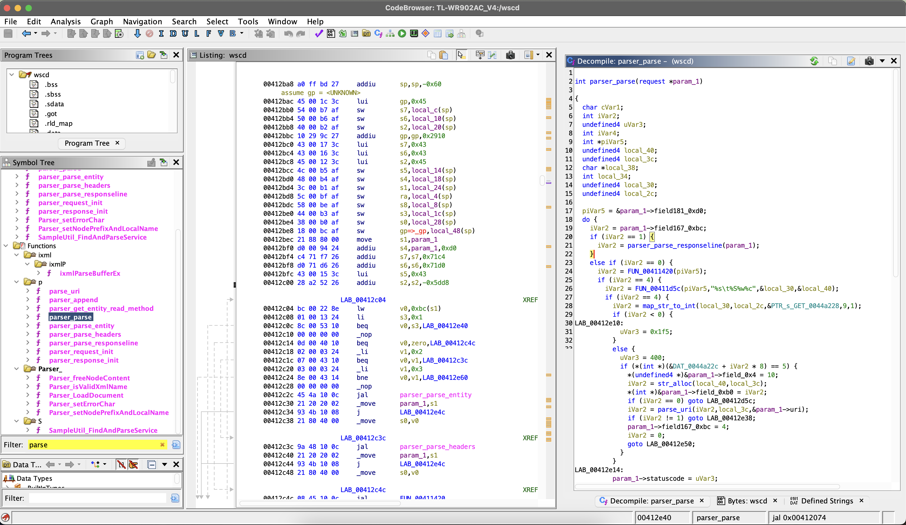
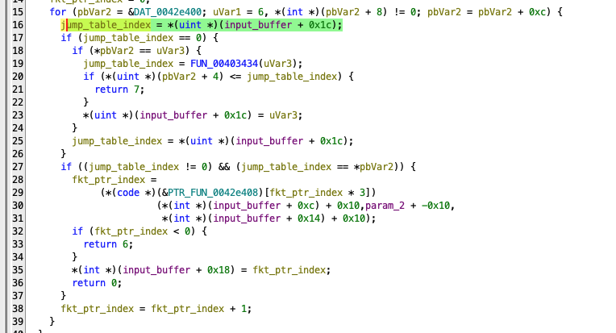
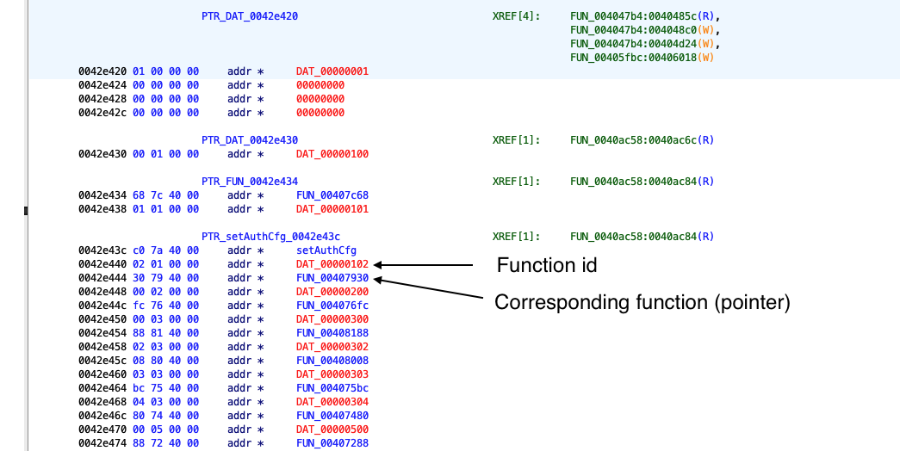
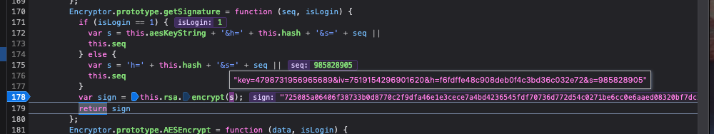
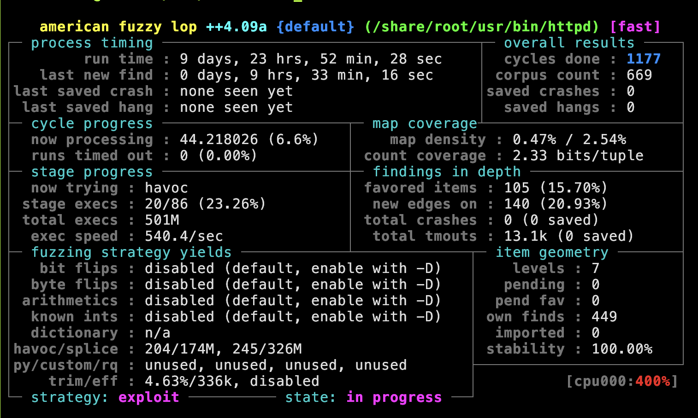

# Blackbox-Fuzzing of IoT Devices Using the Router TL-WR902AC as Example

All files created in context of this term paper are also published in full on GitHub and can be
accessed using the following URL:
[otsmr/blackbox-fuzzing](https://github.com/otsmr/blackbox-fuzzing).

## Introduction

Fuzzing has become "one of the most effective ways" of finding bugs in software. With this or
similar claims, many current fuzzing-related papers start
[\[google-scholar\]](https://scholar.google.com/scholar?start=40&q=Fuzzing+%2B%22most+effective%22&hl=de&as_sdt=0,5).
The main goal of our last term paper about the topic "Internet of Vulnerable Things" was to find a
memory-related bug and then write an exploit for this vulnerability. We were able to find a
vulnerability by reversing the firmware, but no memory related bugs were found. Finding a buffer
overflow by reversing a binary by hand is not only time-consuming, but also requires a lot of
experience. Fuzzing at the same time aims to be the "most effective way" to find such memory related
vulnerabilities.  Google, for example, introduced OSS-Fuzz, which continuously fuzzes open source
software and has already found over 10,000 vulnerabilities across 1,000 projects
[\[oss-fuzz\]](https://github.com/google/oss-fuzz).

The goal of this term paper is again to find a memory-related vulnerability, but this time by using
fuzzing. The goal vulnerability should be exploitable over the network without knowledge of the
admin credentials. This paper describes the way to achieve this goal. For this, the paper is
separated into two parts. The first part focuses on how to find a potent target, which tools can be
used, and what a good fuzzing target should consist of. The second part then describes how to
develop and debug a harness that is able to fuzz a specific function in a binary. Then the developed
harness is used by AFL++ to fuzz the target function. In the following, a short background is given
and what the current state of the art is when it comes to IoT device fuzzing.

### State of the Art

Fuzzing IoT devices is not as easy as fuzzing an open source project.  Often the source code is
proprietary, which makes gray-box fuzzing, which instruments the source code for the best fuzzing
performance, impossible
[\[afl-persistent\]](https://github.com/AFLplusplus/AFLplusplus/blob/stable/instrumentation/README.persistent_mode.md).
Also, the CPU architecture is often not natively supported by fuzzers which requires an emulator
like QEMU [\[qemu\]](https://www.qemu.org/) which also slows down the fuzzing speed
[\[afl-persistent\]](https://github.com/AFLplusplus/AFLplusplus/blob/stable/instrumentation/README.persistent_mode.md).
Another issue is the hardware peripherals, which complicates the development of a general approach.
The paper "Embedded Fuzzing: A Review of Challenges, Tools, and Solutions"
[\[embedded-fuzzing\]](https://cybersecurity.springeropen.com/articles/10.1186/s42400-022-00123-y#Sec12)
gives an overview of different fuzzing strategies, like hardware-based embedded fuzzing. Most of
these strategies need the source code of the target program, like when porting the fuzzers source
code, like AFL, to ARM-based IoT devices to run the fuzzer on the IoT hardware. Running the fuzzer
on the device's hardware also has performance problems because they often have low-level CPUs, which
are slower than normal desktop CPUs. Another approach presented in this paper is emulation-based
embedded fuzzing. Where either a single targeted program is executed in an emulator to perform
coverage-guided fuzzing or the full system.

The above-mentioned approaches all target a binary directly by using an emulator or by instrumenting
the source code. These approaches require a fuzzing setup that must often be specifically crafted
for a single IoT device and are hard to generalize. For that, researchers created a program
`IoTFuzzer` which aims to be an automated fuzzing framework aiming to "finding memory corruption
vulnerabilities without access to their firmware images
[\[iotfuzzer\]](http://staff.ie.cuhk.edu.hk/~khzhang/my-papers/2018-ndss-iot.pdf)." `IoTFuzzers`
based on the observation that most IoT devices have a mobile app to control them, and such apps
contain information about the protocol used to communicate with the device. The program then
identifies and reuses program-specific logic to mutate the test cases to effectively test IoT
targets [\[iotfuzzer\]](http://staff.ie.cuhk.edu.hk/~khzhang/my-papers/2018-ndss-iot.pdf).

### Background

#### Harness

A harness describes a sequence of API calls processing the fuzzer provided inputs. On the contrary
to a normal application, which often does not need a harness, a library that implements reusable
functions must be called with the correct parameters and also in the right sequence, so the state
between multiple shared function calls can be called. Randomly fuzzing the library without building
the state machine is unlikely to be successful and will, in contrast, create a lot of false-positive
crashes when the library dependencies are not enforced.  This can happen when, for example, a buffer
size check is skipped by the fuzzer resulting in a spurious buffer overflow.

In this paper, normal applications will be fuzzed, but because of the hardware dependencies of the
use of sockets and multi-threading, we need to create a harness for them as well. The harness is
loaded in the context of the binary and can call internal functions of the targeted program, as
shown in [Code 10](#c10).

#### Corpus

The term "corpus" describes valid input samples or test cases and serves as a foundational reference
for generating new input data during the fuzzing process. In [Code 10](#c10) this would be, for
example, an HTTP request. Fuzzers then leverage this corpus to create mutated or diversified test
cases, aiding in the detection of software vulnerabilities through the exploration of various input
scenarios.

## Finding a potent target

The most time-consuming part of black box fuzzing is finding a potential
vulnerable function in the firmware. The first step is to find
interesting binaries that, for example, are accessible over the network,
use insecure functions or do not have security features like stack
canary enabled, which is buffer overflow protection. Our last paper
([\[iovt\]](https://raw.githubusercontent.com/otsmr/internet-of-vulnerable-things/main/Internet_of_Vulnerable_Things.pdf)) already described how to extract the firmware
from the targeted router and how to find a potentially dangerous binary.
For this, the tool EMBA [\[emba\]](https://github.com/e-m-b-a/emba) was used. EMBA ranks all
binaries found in the firmware by the count of unsecure functions like
`strcpy`, network access, and security protection like stack canary or
the NX-Bit which become interesting when exploiting a buffer overflow,
which can be found in [Code 1](#c1).

<div id="c1"></div>

```txt
[+] STRCPY - top 10 results:
 235   : libcmm.so       : common linux file: no  |  No RELRO  |  No Canary  |  NX disabled  |  No Symbols  |  No Networking |
 77    : wscd            : common linux file: no  |  No RELRO  |  No Canary  |  NX disabled  |  No Symbols  |  Networking    |
 [snip]
 28    : httpd           : common linux file: yes |  RELRO     |  No Canary  |  NX enabled   |  No Symbols  |  Networking    |
 27    : cli             : common linux file: no  |  No RELRO  |  No Canary  |  NX disabled  |  No Symbols  |  No Networking |
```
<p style="text-align: center">Code 1: EMBAs result of unsecure uses of the function strcpy.</p>

Because the goal of this paper is to find a memory vulnerability that can be exploited over the
network without the knowledge of the admin credentials, the vulnerable function must be callable
over the network and should interact directly with the provided user input. But having network
interaction does not mean the binary is also directly accessible over the network. To find out which
binaries are listening, we can use the UART root shell, which was already established in
[\[iovt\]](https://raw.githubusercontent.com/otsmr/internet-of-vulnerable-things/main/Internet_of_Vulnerable_Things.pdf).

<div id="c2"></div>

```txt
 ~ # netstat -tulpn
Active Internet connections (only servers)
Proto Recv-Q Send-Q Local Address           Foreign Address         State       PID/Program name
tcp        0      0 127.0.0.1:20002         0.0.0.0:*               LISTEN      1045/tmpd
tcp        0      0 0.0.0.0:1900            0.0.0.0:*               LISTEN      1034/upnpd
tcp        0      0 0.0.0.0:80              0.0.0.0:*               LISTEN      1027/httpd
tcp        0      0 0.0.0.0:22              0.0.0.0:*               LISTEN      1224/dropbear
udp        0      0 0.0.0.0:20002           0.0.0.0:*                           1048/tdpd
[...]
```
<p style="text-align: center">Code 2: Using the UART root shell to execute netstat</p>

### Reversing the binary

The first binary that looks promising is `wscd`. The binary has the most unsafe `strcpy` calls
(except for the libcmm.so library) and network interaction, which in the case of `wscd` means it
connects to a `UPnP` device and does not listen on a specific port. It has, as shown later, an easy
function to fuzz, which is why this binary was selected as an example in this paper to explain the
general procedure. Before reversing, we can use the UART root shell to find out if the binary is
running and how it was started.

<div id="c3"></div>

```txt
$ ps
 PID USER       VSZ STAT COMMAND
 962 admin     1096 S    wscd -i ra0 -m 1 -w /var/tmp/wsc_upnp/
1018 admin     1080 S    wscd_5G -i rai0 -m 1 -w /var/tmp/wsc_upnp_5G/
```
<p style="text-align: center">Code 3: Using the command ps to display all running programs.</p>

With `ps` we not only see that the binary is running but also what the arguments are, which are
important to verify if a potential function is called at all. The meaning of these arguments can be
gained from the CLI help, which is displayed when calling the binary without any arguments.

<div id="c4"></div>

```txt
$ chroot root /qemu-mipsel-static /usr/bin/wscd
Usage: wscd [-i infName] [-a ipaddress] [-p port] [-f descDoc] [-w webRootDir] -m UPnPOpMode -D [-d debugLevel] -h
 -i:  Interface name this daemon will run wsc protocol(if not set, will use the default interface name - ra0)
       e.g.: ra0
 -w: Filesystem path where descDoc and web files related to the device are stored
       e.g.: /etc/xml/
 -m: UPnP system operation mode
       1: Enable UPnP Device service(Support Enrolle or Proxy functions)
       2: Enable UPnP Control Point service(Support Registratr function)
       3: Enable both UPnP device service and Control Point services.
 [...]
```
<p style="text-align: center">Code 4: Options of the binary wscd.</p>

As shown in [Code 4](#c4) `wscd` is started with "Enabled UPnP Device service" which looks
promising. After verifying that the binary is actually running on the router, the binary can then be
analyzed using [Ghidra](https://ghidra-sre.org/) to search for suspect functions. For fuzzing,
parsing functions are especially interesting because they are usually complex, and often the input
that is parsed has length fields for the containing data, like the TCP packet contains the length of
the payload.

<div id="f1"></div>
<figure>
  <p> </p>
  <figcaption>
    <p>Figure 1: Using Ghidra to search for parsing functions.</p>
  </figcaption>
</figure>

Another benefit of a parsing functions is that they often do not interact with other parts of the
code or have user interaction over the network. So the parsing function can be called directly with
the input without modifying the binary or overwriting other functions, so the function can be
fuzzed.

Before starting to fuzz the function, it should be checked if the function is triggered at all,
because the function is only interesting when it is called with a user-controlled input. For this,
Ghidra can be used to search for references to the target function. In the case of the
`parser_parse` function there are multiple ways. Because we know how the program is started, the
calls can be reduced to a single function call tree, shown in [Code 5](#c5).

<div id="c5"></div>

```c
main()
 if ((WscUPnPOpMode & 1) != 0) // Argument -m 1
  WscUPnPDevStart()
   UpnpDownloadXmlDoc() -> my_http_Download() -> http_Download()
     if (http_MakeMessage())
      http_RequestAndResponse()
       http_RecvMessage()
```
<p style="text-align: center">Code 5: Call tree of the function parser_parse</p>

After a target function is found, we can now create a fuzzing setup to fuzz the function, which is
described in the next part. But first other potent functions are presented.

### Other potential vulnerable functions

For this paper, multiple potential binaries were manually analyzed for suspect functions. The
following is a short summary of other possible targets which were found.

The binary **httpd** is the backend for the admin web interface. The binary is accessible over the
network on port 80. One interesting function in `httpd` is the `httpd_parser_main` function. While
skimming the parser implementation using Ghidra several different suspect code parts could be
identified. One of the suspect parts is the parsing of the `Content-Type`. In the following, a basic
HTTP request can be found.

```txt
POST / HTTP/1.1\r\n
Content-Type: multipart/form-data; boundary=X;\r\n
Host: example.com\r\n
\r\n
\r\n
DATA\r\n
```

Below is a snippet from the `httpd_parser_main` function which parses the `Content-Type` from the
user provided http request.


<div id="c6"></div>

```c
// user_input_ptr points to
//  "Content-Type: multipart/form-data; boundary=X;\r\nHost: example.com\r\n..."
cursor = strstr(user_input_ptr,"multipart/form-data");

if (user_input_ptr == cursor) {
 cursor = strstr(user_input_ptr,"boundary=");
 user_input_ptr = cursor + 9;

 // user_input_ptr points now to "X;\r\nHost: example.com\r\n..."

 if (cursor != (char *)0x0) {

  do {
    while (cursor = user_input_ptr, *cursor == " ") {
      user_input_ptr = cursor + 1;
    }
    user_input_ptr = cursor + 1;
  } while (*cursor == "\t");

  // cursor points now to "X;\r\nHost: example.com\r\n..."

  // strchr returns a pointer to the first occurrence of ";" in the user request.
  // If ";" is not found, the function returns a null pointer.
  user_input_ptr = strchr(cursor, ";");
  if (user_input_ptr != (char *)0x0) {
    // The character ";" is replaced by an null byte to terminate the string
    *user_input_ptr = "\0";
    // cursor points now to "X\0\r\nHost: example.com\r\n..."
  }

  // DAT_00444050 global array from 0x00444050 to 0x0044414f (255 Bytes)
  strcpy(&DAT_00444050, cursor);
  // DAT_00444050 contains now "X"
 }
}
```
<p style="text-align: center">Code 6: Call tree of the function parser_parse</p>

The vulnerability in this code is the function call `strcpy` and the assumption that the
`Content-Type` ends with a semicolon. Because `strcpy` copies the buffer until the next null byte,
and as shown in [Code 6](#c6) the null byte is only added when a semicolon is found. By removing the
semicolon, the next null byte is at the end of the input buffer, e.g., the end of the HTTP request.
So the global variable DAT_00444050 can be overflowed, which then overwrites data beyond the address
0x0044414f. The challenging part is not only to find an interesting global variable beyond this
address that could be overwritten, but also that no null bytes can be used because of `strcpy`. But
when there is one such mistake, there are probably more to find.

The binary **tdpd** is used by the mobile app and is accessible over UDP on the local network.
`tdpd` has almost the same functions as the `tmpd` which are mostly just never called. The main
function only listens for messages over the UDP port and always responds with basic information
about the router, like the name or model. There is barely any interaction with the user-provided
input, which is therefore not interesting to fuzz.

Another interesting pair of binaries are **upnpd** and **ushare**. Both binaries are handling `UPnP`
messages which therefore need to parse XML.  Because a copyright string can be found in the binary,
it can be assumed that these programs were not developed by TP-Link.

```sh
$ strings usr/bin/ushare | grep "(C)"
Benjamin Zores (C) 2005-2007, for GeeXboX Team.
```

Both binaries are loading the shared libraries `libupnp.so` and `libixml.so` which have the same
functions as the open source project `pupnp` [\[pupnp\]](https://github.com/pupnp/pupnp/). Because
the focus of this paper is black box fuzzing, these binaries are ignored. But gray box fuzzing this
library could have potential because in 2021 a memory leak was found in `libixml.so`
[\[pupnp-mem-leak\]](https://github.com/pupnp/pupnp/issues/249).

The binary **tmpd** is the backend of the mobile app. The interesting part is that the router and
the mobile app are communicating over a custom binary protocol. In the following, a message from the
client to the server is shown.

<div id="c7"></div>

```txt
00000000  01 00 05 00 00 08 00 00  00 00 00 17 50 7b 6e fe  |............P{n.|
00000010  01 01 02 00 00 00 00 00                           |........        |
```
<p class="text-align: center">Code 7: Message from the mobile app to the router.</p>

To understand the binary protocol, the binary `tmpd` was reversed using Ghidra. With this
information, the message in [Code 7](#c7) can be broken down into the following:


```txt
01 00 05 00 : Version
00 08 00 00 : Size (8 Bytes)
00 00 00 17 : Datatype
50 7b 6e fe : Checksum (CRC32)
01 01       : Options
02 00       : Function id
00 00 00 00 : Function parameters
```
<p class="text-align: center">Code 8: Custom binary protocol broken down.</p>

This looks promising because such binary protocols must be parsed. But the most suspect part of the
binary protocol is not the length field, but the use of the function ID and function parameters.


<figure id="f2">
  <p></p>
  <figcaption>
    <p style="text-align: center">Figure 2: Reversed function from tmpd which parses the function id and their parameters.</p>
  </figcaption>
</figure>

[Figure 2](#f2) shows a part of the decompiled parser function of the custom protocol. In line 16,
the function ID is extracted, and the corresponding function is then called in line 29. The suspect
behavior is that the function is called with parameters extracted without any check from the
user-controlled input buffer. We could now try to find a function in the jumping table shown in
[Figure 3](#f3) where this could be dangerous, like when the parameter is used to index a buffer
or interpreted as a string. Instead of manually reversing and searching the over 100 functions,
which would be time-consuming, we can use a fuzzer which would do this automatically.

<figure id="f3">
<p></p>
<figcaption><p style="text-align: center">Figure 3: Reversed function from tmpd which parses the function ID
and its parameters.</p></figcaption>
</figure>

Unfortunately, the `tmpd` binary is only locally reachable over the network, as shown in [Code
2](#c2). To connect to this binary, the app first connects to the router via SSH in the mode
`direct-tcpip` which just forwards the packets to the local process. And the SSH connection is
protected by the admin credentials. But as described in
[\[iovt\]](https://raw.githubusercontent.com/otsmr/internet-of-vulnerable-things/main/Internet_of_Vulnerable_Things.pdf)
the SSH connection can easily be compromised because the server host key is never checked by the
app. By dropping every packet routed to the internet, the admin can be tricked into logging in to
the router while a man-in-the-middle attack is performed to steal the credentials.

## Fuzzing with AFL++ and QEMU

In this section, a harness is developed targeting one of the previously found function. After the
harness is developed, the state-of-the-art fuzzer AFL++
[\[aflpp\]](https://github.com/AFLplusplus/AFLplusplus) is used to fuzz the target function. Because
the binaries are compiled for the `mipsel` architecture, the emulator QEMU is used to execute the
binary. The basic fuzzing setup used in this paper is mostly inspired by the blog entry "Firmware
Fuzzing 101" by Adam Van Prooyen [\[b101\]](https://www.mayhem.security/blog/firmware-fuzzing-101).

### Fuzzing environment

To easily create a reproducible fuzzing environment, Docker is the best choice. We created a
Dockerfile that installs every necessary tool, like a cross-compiler for `mipsel` CPU architecture
or `gdb-multiarch` which can be used to debug the harness.

Furthermore, AFLplusplus is downloaded and compiled together with QEMU which is built in a version
with minor tweaks to allow non-instrumented binaries to be run under afl-fuzz.

```docker
FROM debian:latest

RUN apt update && apt install -y \
      curl \
      vim \
      gcc-mipsel-linux-gnu \
      openssh-server \
      qemu-user-static \
      gdb-multiarch
# Qemu statics are installed at /usr/bin/qemu-mipsel-static

# Compiling AFL++
RUN apt install -y git make build-essential clang ninja-build pkg-config libglib2.0-dev libpixman-1-dev
RUN git clone https://github.com/AFLplusplus/AFLplusplus /AFLplusplus
WORKDIR /AFLplusplus
RUN make all
WORKDIR /AFLplusplus/qemu_mode
RUN CPU_TARGET=mipsel ./build_qemu_support.sh

RUN echo "#!/bin/bash\n\nsleep infinity" >> /entry.sh
RUN chmod +x /entry.sh

WORKDIR /share
ENTRYPOINT [ "/entry.sh" ]
```

Dockerfile which installs necessary tools.

The image can then be built using `docker build`.

```sh
docker build -t fuzz .
```

When the image is built, it can be easily used with `docker run` which
then starts the container.

```sh
docker run -d --rm -v $PWD/:/share --name fuzz fuzz
```

Using the option `-d` will start the container in the background. With `docker exec` multiple shells
can be started inside the container, which is helpful to start the executable in one session using
QEMU and in the other session `gdb-multiarch`.

```sh
docker exec -it fuzz /bin/bash
```

### Overwrite the main function

In the previous section, a potent fuzz target was identified. The problem is that when executing the
binary, we will never reach the function call because the `parser_parse` function is only called if
a TCP packet is received over a socket. This would be not only bad for performance, but also hard to
set up. This is why the entry of the fuzzer should be at an different location than the normal main
function.  For this, the environment variable `LD_PRELOAD` which enables injecting a harness that
has access to internal functions, can be used. As the man page of `ld.so`, which is responsible for
linking the shared libraries needed by an executable at runtime, describes, `LD_PRELOAD` can be used
"to selectively override functions in other shared objects
[\[man-pages\]](https://www.man7.org/linux/man-pages/man8/ld.so.8.html)."

The function `__uClibc_main` is best suited for this purpose. To overwrite this function, a C file
must be created that contains a function with the same name.

```c
void __uClibc_main(void *main, int argc, char** argv) {
    // Harness code, e.g. call the function parser_append
    printf("My custom __uClibc_main was called!");
}
```

The C file can then be cross-compiled to a shared object in the mipsel architecture using
`mipsel-linux-gnu-gcc`. The option `-fPIC` enables "Position Independent Code" which means that the
machine code does not depend on being located at a specific address by using relative addressing
instead of absolute.

```txt
$ mipsel-linux-gnu-gcc parser_parse_hook.c -o parser_parse_hook.o -shared -fPIC
```

The newly created shared library can then be loaded by adding the environment variable `LD_PRELOAD`
to the QEMU command.

```txt
$ chroot root /qemu-mipsel-static -E LD_PRELOAD=/parser_parse_hook.o /usr/bin/wscd
My custom __uClibc_main was called!
```

With the command `chroot` the current and root directories can be changed for the command provided.
This is helpful because the executable `wscd` opens other files, like shared libraries from the
firmware. We can see this behavior by adding the argument `-strace` to QEMU.

```txt
chroot root /qemu-mipsel-static -E LD_PRELOAD=/parser_parse_hook.o -strace /usr/bin/wscd /corpus/notify.txt
38180 mmap(NULL,4096,PROT_READ|PROT_WRITE,MAP_PRIVATE|MAP_ANONYMOUS|0x4000000,-1,0) = 0x7f7e7000
38180 stat("/etc/ld.so.cache",0x7ffffa48) = -1 errno=2 (No such file or directory)
38180 open("/parser_parse_hook.o",O_RDONLY) = 3
38180 fstat(3,0x7ffff920) = 0
38180 close(3) = 0
38180 munmap(0x7f7e6000,4096) = 0
38180 open("/lib/libpthread.so.0",O_RDONLY) = 3
38180 open("/lib/libc.so.0",O_RDONLY) = 3
[...]
```

As we can see, the executable opens multiple libraries in the `/lib/` folder on the firmware and not
on the host.

### Developing and debug the harness

After the setup is created, we can now start developing a harness. As described in the background
section, the harness is the driver between the fuzzer and the target function. The harness loads the
fuzz input, which is stored by AFL++ in a file. With the file path as parameters, the harness then
calls the fuzzing target; in this case, this would be `parser_append`. The functions can be called
by using the address.

<div id="c10"></div>

```c
void __uClibc_main(void *main, int argc, char** argv)
{
  // Verify that a filename is provided
  if (argc != 2) exit(1);

  // Create function pointer to the fuzz target
  int (*parser_request_init)(void *, int) = (void *) 0x00412564;
  int (*parser_append)(void *, void *, int) = (void *) 0x00412e98;

  // Open the fuzz input file
  int fd = open(argv[1], O_RDONLY);
  char fuzz_buf[2048 + 1];
  int fuzz_buf_len = read(fd, fuzz_buf, sizeof(fuzz_buf) - 1);
  if (fuzz_buf_len < 0) exit(1);
  fuzz_buf[fuzz_buf_len] = 0;

  // Call the target functions
  uint8_t parsed_data[220];
  parser_request_init(parsed_data, 8);
  int status = parser_append(parsed_data, fuzz_buf, fuzz_buf_len);
  printf("Response is %d\n", status);
  exit(0);
}
```
<p style="text-align: center">Code 10: Harness code with the fuzz target `parser_append` in the binary wscd.</p>

As shown in [Code 10](#c10) the function `parser_parse` is not called directly but by using the
function `parser_append`. Before this function is called, the initialization function
`parser_request_init` must be called, which initializes the output struct of the `parser_parse`
function.

While in the case of the `parser_parse` the harness is pretty easy to set up, other targets require
more sophisticated harnesses like the `httpd_parser_main` function. For example, before calling the
target, the function `http_init_main` must be called, which ends in a SIGSEGV.  To find out where
this segmentation fault is caused, it is useful to debug the code with a debugger like `gdb`. To do
this, QEMU can be started with the option `-g` which spawns a `gdb-server` at the provided port.

```sh
chroot root /qemu-mipsel-static -strace -g 1234 -E LD_PRELOAD="/httpd_parser_main.o" /usr/bin/httpd
corpus/httpd/simple.txt
```

Because the binary is in the `mipsel` architecture `gdb-multiarch` must be used. After gdb is
started, the following init script can be loaded with gdb using `sources <path to script>`.

```sh
set solib-absolute-prefix /share/root/
file /share/root/usr/bin/httpd
target remote :1234
# break bevor fuzz target is called
# break __uClibc_main
break http_parser_main
display/4i $pc
```

Because of the chroot the script first changed the absolute prefix path so that when the binary
loads a shared object, gdb will find the file.  Then the targeted file is set, because QEMUs
gdb-server does not support file transfer, so gdb tries to load the files from the disk instead.
After gdb is configured, the script then connects to the gdb-server with `target remote` and creates
a breakpoint at the start of the target function. With display, the output is just improved, so when
stepping through, the next four lines of assembly will be shown. Using `si` we can step one
instruction, which is useful when the harness has a segmentation fault using the default corpus,
which should always work.  As shown in [Code 11](#c11) the binary has a segmentation fault in the
function `fprintf`.

<div id="c11"></div>

```sh
(gdb) si
0x004059b0 in http_parser_makeHeader ()
1: x/4i \$pc
=> 0x4059b0 <http_parser_makeHeader+120>:       jalr    t9
   0x4059b4 <http_parser_makeHeader+124>:       addiu   a1,a1,16248
   0x4059b8 <http_parser_makeHeader+128>:       li      v0,200
   0x4059bc <http_parser_makeHeader+132>:       lw      gp,16(sp)
(gdb) ni
0x7f56a8ac in fprintf () from /share/root/lib/libc.so.0
1: x/4i \$pc
=> 0x7f56a8ac \<fprintf+44>:     bal     0x7f56db80 <vfprintf>
   0x7f56a8b0 \<fprintf+48>:     nop
   0x7f56a8b4 \<fprintf+52>:     lw      ra,36(sp)
   0x7f56a8b8 \<fprintf+56>:     jr      ra
   0x7f56a8bc \<fprintf+60>:     addiu   sp,sp,40
(gdb) n
Single stepping until exit from function fprintf,
which has no line number information.

Program received signal SIGSEGV, Segmentation fault.
```
<p style="text-align: center">Code 11: Segmentation fault in printf.</p>

To investigate the error, Ghidra can be used to find out with which parameters the function is
called.

```c
fprintf(
 *(FILE **)(iVar1 + 0x101c),
 "HTTP/1.1 %d %s\r\n",
 *(undefined4 *)(&DAT_0042ee68 + (uint)(byte)(&DAT_00414570)[statuscode & 0x3f] * 8),
 (&PTR_DAT_0042ee6c)[(uint)(byte)(&DAT_00414570)[statuscode & 0x3f] * 2]
);
```

The SIGSEGV is probably caused by the fact that the first parameter is not a file descriptor but a
null pointer. Where `iVar1`` is just a reference to the input of the `httpd_parser_main` function.
This means that the fuzzing input must have a file descriptor at position 0x101c.  So the input must
be adjusted to the following struct.

```c
typedef struct  {
  int _a;     // 4 Bytes
  int _b;     // 4 Bytes
  int socket; // 4 Bytes
  int ip;     // 4 Bytes
  int mac;    // 4 Bytes
  unsigned char body[0x1008]; 0x101c - 4*5 = 0x1008 Bytes
  FILE * fd_out; // expected to be a valid file descriptor
} HttpMainT;
```

Because `fd_out` must just be a valid file descriptor pointer, it can easily be set to `stdout`.
Executing the `httpd_parser_main` again will now produce a valid HTTP output.

```c
$ chroot root /qemu-mipsel-static -E LD_PRELOAD=/httpd_parser_main.o \
    /usr/bin/httpd /httpd_corpus.txt

bind: No such file or directory
[ dm_shmInit ] 086:  shmget to exitst shared memory failed. Could not create shared memory.
rdp_getObj is called with: 4274932gdpr_getSystemGDPREntry Error
gdpr_getNewSystemGDPREntry OK
#Msg: getsockname error
HTTP/1.1 200 OK
Content-Type: text/html; charset=utf-8
Content-Length: 24257
Set-Cookie: JSESSIONID=deleted; Expires=Thu, 01 Jan 1970 00:00:01 GMT; Path=/; HttpOnly
Connection: close

<!DOCTYPE html>
[...]
```

The harness works now and can be used to fuzz the function using AFL++ which will be explained in
the next section.

### Generate corpus data

As mentioned in the background, a seed corpus describes valid input samples, which serves as a
foundational reference for generating new input data during the fuzzing process.

These inputs are typically chosen to represent different aspects of the target programs. The seed
corpus is used by a fuzzer to generate mutated or evolved test cases that are then run against the
target software to uncover bugs, crashes, or other problems. This corpus plays an important role in
directing the fuzzer to relevant areas of the program and increasing the probability of detecting
vulnerabilities or unexpected behaviors. By providing a diverse and representative set of initial
inputs, the seed corpus helps the fuzzer explore different paths in the target faster and thereby
increases coverage.

When it comes to functions parsing network data, these inputs can be created by using Wireshark to
record different packets.

For the function, `httpd_parse_main` four different corpora were created. Each targeting different
paths in the binary. One example is the login request, which contains the username and password. For
this corpus, the harness had to be modified because TP-Link uses (weak) cryptography to "protect"
the password. For this, the password is encrypted in the browser using AES and then decrypted on the
backend.  Whereby the password is generated in the browser and then encrypted using RSA. Then the
encrypted data is signed. Because a fuzzer can not create a signature or encrypt data, some
functions were overwritten and now just decodes the data from base64. For this, the data were first
extracted in plaintext from the browser using the debugger shown in [Figure 4](#f4).

<div id="f4"></div>

<figure>
  <p></p>
<figcaption><p style="text-align: center">Figure 4: Extracting the data bevor encryption.</p></figcaption>
</figure>

In the target, the function `rsa_tmp_decrypt_bypart` was then overwritten to replace the logic from
decrypting the data to just decoding from base64.

```c
// Replacing the logic with b64_decode
int rsa_tmp_decrypt_bypart(uint8_t *input, int input_len, uint8_t *output) { // other params just key data
  int (*b64_decode)(uint8_t *, int, uint8_t *, int) = (void *) 0x0040bf00;
  b64_decode(output, 0x1000, input, input_len);
  int * seqnumber = (int *) 0x00444db0;
  *seqnumber = 0x3ac28e29-input_len+12;
  return 0; // says it was okay
}
```
<p style="text-align: center">Code 12: Function rsa_tmp_decrypt_bypart now just decodes base64
instead of decrypt the data.</p>

While executing the corpus, the target function always returns an HTML document with the error "408
Request Timeout". Using Ghidra and GDB the problem could be identified. The error always happens
after the function call to `http_stream_fgets`. The problematic line was the check for the line
break character `\n`.

```c
if (((cVar1 == '\n') && (param_3 < pcVar4)) && (pcVar4[-1] == '\r')) {
```

This condition enforces that after every line break, a carriage return must follow. After adding the
carriage return, all the created corpora worked.

### Fuzz the target

In the last section, we developed multiple harnesses and executed them using QEMU. In this section,
QEMU is replaced by AFL++ which gets the generated corpora as seed input to fuzz the target
function. In the section "Fuzzing environment" a docker image was created that already pulls AFL++
from GitHub and then uses an AFL++-provided script to build a patched version of QEMU. So AFL++ can
now be started with the following command that gets different parameters, like `-Q` which tells
AFL++ to use the patched version of QEMU.

```sh
QEMU_LD_PREFIX=/share/root AFL_PRELOAD=/share/root/httpd_parser_main.o \
  /AFLplusplus/afl-fuzz -Q \
  -i /share/root/corpus/httpd/ -o /share/afl-out/httpd/ \
  -- /share/root/usr/bin/httpd @@
```
<p style="text-align: center">Code 13: Fuzzing the binary <code>httpd</code> using the harness
and <code>afl-fuzz</code>.</p>

Unlike before, the command `chroot` is no longer necessary and is replaced by the variable
`QEMU_LD_PREFIX`. Which tells QEMU where to search for shared objects. Also, the `LD_PRELOAD`
variable is replaced by the AFL-specific version `AFL_PRELOAD`. The last argument in the command is
the two `@` characters. They will be replaced by AFL++ with a file path that holds the fuzzing
input. When started, AFL++ shows the progress using the terminal UI shown in [Figure 5](#f5).

<div id="f5"></div>
<figure>
<p></p>
<figcaption><p style="text-align: center">Figure 5: The status screen from AFL++.</p></figcaption>
</figure>

The `AFL++` status screen provides essential insights into the current fuzzing process. The docs of
`AFL++` have a nice overview of the terms used in the status screen
[\[afl-screen\]](https://aflplus.plus/docs/status_screen/).  When debugging the corpus with the
following environment variables, the UI can be disabled and with `AFL_DEBUG` a detailed logging
enabled, which shows the current fuzzer input and the `stdout` from the target program.

```sh
export AFL_DEBUG=1 && export AFL_NO_UI=1
unset AFL_DEBUG && unset AFL_NO_UI
```

As shown in [Figure 5](#f5) fuzzing a binary can take quite some time. According to the docs it
"should be expected to run for days or weeks" and "some jobs will be allowed to run for months." To
improve the time needed, the exec speed should be above 100 execs/sec. When, for example, the target
`httpd_main_parser` was fuzzed, the exec speed was at the beginning by around 30/sec. To improve the
speed, the target binary was searched for suspect functions, which are probably the cause of the
slowdown. One of the suspect functions was `rsa_gdpr_generate_key` because generating an RSA key is
known to be slow. After overwriting the function, the speed improved to 600 executions per second.

One indicator that helps indicate when to stop fuzzing is the cycle counter. AFL++ will highlight
the number in green when "the fuzzer has not been seeing any action for a longer while," which helps
to make the call to stop the fuzzer.

But the most interesting number is probably "total crashes". This shows when the program crashes
because of the current fuzzing input and is probably a memory-related bug. To verify that this is a
real bug `gdb` can be used again to find the position of the bug.

## Conclusion

Fuzzing may be the most effective way to find security vulnerabilities.  In this term paper, three
different functions were fuzzed, but none were found. While the black box fuzzing setup itself is
not that complex and time-consuming, finding a potent target and developing a working harness are.
Most of the time, the harness has to be debugged, and then the underlining logic in the binary must
be reversed, which again consumes a long time.
