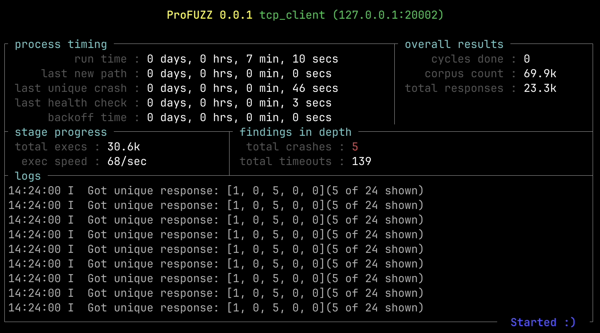
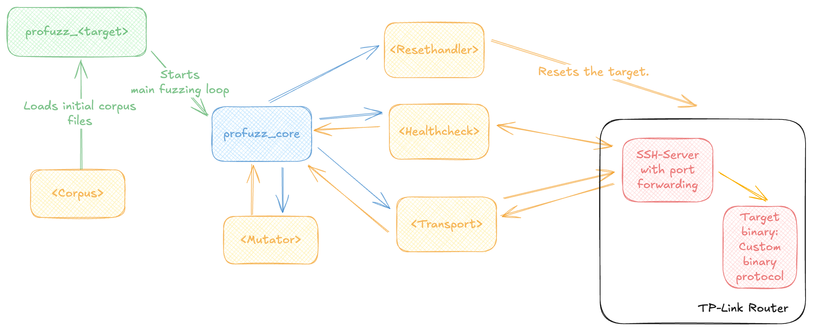

# Introducing my new Generic Network Protocol Fuzzer in Rust

This blog post introduces my new open source [Generic Network Protocol Fuzzer](https://github.com/otsmr/profuzz) written in Rust.



When I am not working on my European Snapchat alternative [twonly](https://twonly.eu) I do pentests of embedded devices, either during [my studies](https://github.com/otsmr/internet-of-vulnerable-things) or at work looking into ECUs running in a vehicle. When doing such pentests, one of the most promising tools is fuzzing. I usually start with setting up Afl++ when either the source code is available or, in case the source code is missing, I [emulate the binary with QEMU](https://tsmr.eu/blackbox-fuzzing.html). But when I am not in the possession of the source code and do not have any binary to work with I use [boofuzz](https://boofuzz.readthedocs.io/en/stable/), a network protocol fuzzer. Because network-based fuzzing is not as efficient as using AFL++ with coverage, I use them more as a starter to find low-hanging fruit without having to put a lot of effort into a working hardware debugging setup. My ultimate goal is to integrate a fuzzing-first approach into my pentesting tool at work. However, I quickly reached the limits of Boofuzz. Probably because it is written in Python it is kinda slow. It is also hard to integrate into my current tooling, which is written in Rust. As I also want to use the fuzzer for all kinds of other targets like a [TP-Link router](https://tsmr.eu/blackbox-fuzzing.html) I decided to create a generic network protocol fuzzer. 

Because I am a typical developer, names are not my main field of expertise. As I am writing a **pro**tocol **fuzz**er, this project is named `profuzz`. If you have a better idea, please contact me :).

## Network Protocol Fuzzing vs Coverage-based Fuzzing  

If you are new to fuzzing at all, please check out [my last blog post](https://tsmr.eu/blackbox-fuzzing.html) where this is described in more detail.

There are multiple differences between a network protocol fuzzer and fuzzing with coverage like AFL++ does:

### Execution and Control
When using AFL++, the target binary is executed on a Linux-based system, either directly or using an emulator like `QEMU`. This allows AFL++ to have full control over the target. Also the way to control the target is always the same as it is run as a normal binary on the system. When fuzzing over the network, the fuzzer does not have this kind of control. The execution must either be ensured by the pentester or by using a special setup like using a smart plug to restart the device.

### Coverage information
To efficiently fuzz, AFL++ uses coverage data in order to mutate the corpus files in a smart way to reach all possible code paths. But when fuzzing over the network, the fuzzer is not able to get this data. When fuzzing a protocol like UDP, there is no information at all the fuzzer can leverage. Even for fuzzing with AFL++, speed does matter, but when there is no coverage information and the mutation only relies on randomness, the speed is crucial to increase the efficiency.

### Knowledge about the target
Fuzzing with AFL++ often requires a harness that forces the author to have a basic understanding of the target code. This understanding is also required when using a black box approach, as the entry function has to be called and some non-fuzzable functions like a signature generation have to be hooked. In the case of network protocol fuzzing, almost no knowledge about the target is required, only about the protocol that is fuzzed. So when fuzzing the network stack, the fuzzer must know where checksums are and how to calculate a valid one, as it is not possible to hook the validation function. While the protocol must be known, the target code must not be understood, and no complex setup has to be created (until a crash is found and must be debugged). This also has the advantage that when fuzzing embedded devices that do not run on Linux, the setup is much easier as the hardware dependencies do not have to be patched out or simulated.

### Structured Fuzzing 
When fuzzing over the network, fields like checksums or the destination MAC address have to be valid in order for the packet to reach the target and to increase the coverage, including also the upper layers. The fuzzer must also “understand” the protocol and fuzz with valid messages and only occasionally modify length fields or produce an invalid checksum.

## Building some fundamental stuff

As explained in the last segment, the fuzzer must know the protocol to calculate valid checksums or set fields like the next payload in order for the target to parse the packet and increase the fuzzing coverage. In Python, Scapy can be used for crafting network packets, but as I am writing my fuzzer in Rust, I need a similar library written in Rust. One potential library I found is called `packet_rs`, but it is missing “magic” functions like `build` that do set all required fields, like the checksum. After some more research, I ended up using [pnet](https://docs.rs/pnet/latest/pnet/) a crate consisting of multiple sub-crates [pre-defining a lot of common network packages](https://docs.rs/pnet_packet/latest/pnet_packet/). But still the “magic” functions were missing. The project also created a proc-macro that makes it easy to add new packages. At work, I am required to implement a lot of automotive protocols and fuzz them, and this [proc](https://github.com/libpnet/libpnet/tree/main/pnet_macros)-[macro](https://github.com/libpnet/libpnet/tree/main/pnet_macros_support) makes that easier. So I created a wrapper crate around the `pnet_packet` crate implementing the magic functions for the different packets. The wrapper is called `pnet_layers` and can be found on [crates.io](https://crates.io/crates/pnet_layers). `pnet_layers` allows to easily parse, craft, and manipulate network packets or, as in my case, to implement a mutation logic (see [here](https://github.com/otsmr/profuzz/blob/main/profuzz_common/src/mutable/pnet.rs)) for the different packets as described later in the post. 


```rs
// Create a new Ethernet Packet
let mut ether = EtherMut::new();

// Modify the packet. The `modify` function returns the pnet defined mutable packet to modify the different field.
if let Some(mut eth) = ether.modify() {
    eth.set_source(MacAddr::from_str("3c:ce:33:33:33:33").unwrap());
    eth.set_destination(MacAddr::broadcast());
}

// Using the `add` function new layers can be added.
ether.add(LayerMut::Vlan(VlanMut::new()));
ether.add(LayerMut::Ipv4(Ipv4Mut::new()));
ether.add(LayerMut::Udp(UdpMut::new()));
ether.add(LayerMut::Payload(PayloadMut::from_buf(vec![10; 10]).unwrap()));

println!("{ether}");
// Ether (s: 3c:ce:33:33:33:33, d: ff:ff:ff:ff:ff:ff:ff) > Vlan (id: 1) > Ipv4 (s: 0.0.0.0, d: 0.0.0.0) > Udp (s: 0, d: 0) > [10, 10, 10, 10, 10, 10, 10, 10, 10, 10]

if let Some(bytes) = ether.build() {
    // bytes in format of Vec<u8> which can be send to the network
    // let _ = tx.send_to(&bytes, None);
}
```

## The generic architecture 


<div id="f1"></div>
<figure>
  <p> </p>
  <figcaption>
    <p>Figure 1: The generic architecture of profuzz.</p>
  </figcaption>
</figure>

The main component of profuzz is the crate `profuzz_core` highlighted in blue. `profuzz_core` can be used by the target-specific crate `profuzz_<target>` highlighted in green, which loads the corpus files and starts the CLI. The `profuzz_core` library implements the main fuzzing logic, like mutating the corpus, then sending the mutated packet to the target and checking if the target crashed or not. It does also include a TUI showing the current fuzzing state. While the logic is done by the `profuzz_core` crate the interacting with the target is done by the different implementation of the traits highlighted in yellow. As most of the trait implementation can be reused for other targets, they are collected in the [`profuzz_common`](https://github.com/otsmr/profuzz/blob/main/profuzz_common) crate.

### The main fuzzing loop

The main fuzzing loop can be summarized with the following pseudo-code:

```py
queue = []
for corpus in corpuses:
 for 0..50:
  current = corpus.clone()
  for 0..1000:
   # mutate the current buffer while maintaining the mutation
   current = mutator.mutate(current)
   # store the send buffer
   queue.push(current)
   # send the buffer
   transport.send(current)
   # improve speed by not always doing the healthcheck 
   if elapsed > 4s || ...:
    # check if target is healthy
    if not healthcheck.is_ok();
     # store all send buffers
     output.store_crash(queue)
     # reset target
     resethandler.reset()
    # wait util target is ok again
    while not healthcheck.is_ok(): pass
    # clear queue
    queue = []
```

## Fuzzing the network stack

As fuzzing the network stack is one of my main goals, almost all trait implementations required to initialize the `profuzz_core` crate can be found in the `profuzz_common` crate.

The full example can be found on [Github](https://github.com/otsmr/profuzz/tree/main/example/profuzz_network_stack).

The provided example aims at a target with the following fictive options, which are typical for me at work:

1. To be fuzzed: Ethernet, VLAN, IPv4, UDP, TCP, Payload
2. The target does listen on multiple ports, either for UDP or TCP running different applications
3. The ports which will be fuzzed are only reachable on VLANs 13 and 37
4. The TCP port which will be used for the Healthcheck does not require a VLAN tag

The first step would be to create corpus files. This can be done by using a Wireshark trace and writing each packet as raw bytes in files stored in the folder `corpus`.

Because the fuzzer should also fuzz the Ethernet and VLAN layers, the fuzzer must send the fuzzing input via a raw socket:

```rs
use profuzz_common::transport::raw_socket::RawSocketTransport;
let transport = RawSocketTransport::new("en0");
```

As the target does have a TCP server listening on port 1330, the common health check `TcpHealthcheck` can be used. The health check performs a normal TCP handshake with the listening server and then sends only ACK packets with an invalid number, triggering the target to respond with the correct one. Because there is never data exchanged between the health check and the server, this does work with any TCP server even if there is TLS used in the backend which would close the socket imminently after receiving invalid data. Another cool side effect of using TCP is that a crash can either be detected using a timeout or in case the target sends an RST packet because the server will lose the connection information after it did restart.

```rs
use profuzz_common::healthcheck::tcp::TcpHealthcheck;
let healthcheck = TcpHealthcheck::new(
  "en1", 
  TcpPacket {
      eth_src: MacAddr::from_str("32:a4:e7:9a:c7:99").unwrap(),
      eth_dst: MacAddr::from_str("32:a4:e7:9a:c7:8a").unwrap(),
      vlan_id: None,
      ipv4_src: Ipv4Addr::from([127, 0, 0, 2]),
      ipv4_dst: Ipv4Addr::from([127, 0, 0, 1]),
      dport: 1337,
      sport: 1330,
  },
)
.unwrap();
```

To improve the effectiveness and because the targeted interfaces are listening only on VLAN IDs 13 and 37, the mutation of the network packet implemented by the `EtherMutatorOwned` offered by the `profuzz_common` crate can be restricted using the `set_mutation_constraints` function. 

```rs
set_mutation_constraints(vec![RulePacket {
 eth_saddr: Rpv::Any,
 eth_daddr: Rpv::Any,
 eth_type: Rpv::Any,
 eth_payload: EthPayload::Vlan(RuleVlan {
  id: Rpv::Contains(vec![13, 37]),
  payload: VlanPayload::Any,
 }),
}])
.expect("Could not set constraints.");
```

The struct `EtherMutatorOwned` does implement the trait `Mutate` which is called by the `profuzz_core` crate. When called, this implementation does use randomness to first decide to mutate a single field and, if true how the value is updated. 

```rs
// Implementing the `Mutable` trait for the VLAN packet
// This can be found in the profuzz_common crate with other pre defined network packets.
impl Mutable for VlanMutator<'_> {
    fn mutate<R: rand::Rng>(&mut self, mutator: &mut Mutator<R>) {
        if let Some(mut vlan) = self.0.modify() {
            let mut mutate_vlan_id = true;
            /// Check if there is a rule, if so use the rule to define the VLAN ID
            if let Some(rule) = self.1
                && let Some(RuleLayer::Vlan(rule)) = rule.get_layer(&Layers::Vlan)
                && !rule.id.is_any()
            {
                vlan.set_vlan_identifier(rule.id.as_u16());
                mutate_vlan_id = false;
            }
            /// In case there is no rule, use randomness to decide if the field should be mutated and if so, mutate the field.
            if mutate_vlan_id && mutator.gen_chance(0.5) {
                let mut mutable = vlan.get_vlan_identifier();
                mutator.mutate(&mut mutable);
                vlan.set_vlan_identifier(mutable);
            }
            // For the PRIO and the DEI fields there are no rules, so they could always be modified if the randomness decides to.
            if mutator.gen_chance(0.5) {
                let mut mutable = vlan.get_priority_code_point().0;
                mutator.mutate(&mut mutable);
                vlan.set_priority_code_point(ClassOfService::new(mutable));
            }
            if mutator.gen_chance(0.5) {
                let mut mutable = vlan.get_drop_eligible_indicator();
                mutator.mutate(&mut mutable);
                vlan.set_drop_eligible_indicator(mutable);
            }
        }
        // Call the mutate function from the upper layer to also mutate, for example, the IPv4 packet
        if let Some(upperlayer) = self.0.upper_layer.as_mut() {
            LayerMutator(upperlayer, self.1).mutate(mutator);
        }
    }
}
```

The last step is to initialize the `ProFuzzer` with the previously defined implementations of the traits and then to call the `start_cli` function offering the user a CLI to start the fuzzer or to triage a finding. 

```rs
let fuzzer = ProFuzzer::new(transport, healthcheck, DummyResetHandler());
if let Err(err) = fuzzer.start_cli::<EtherMutatorOwned>().await {
    eprintln!("{err}");
}
```

The CLI currently offers either to triage a crash or to start the protocol fuzzer.

```plain
Usage: profuzz_network_stack [OPTIONS] <COMMAND>

Commands:
  triage  Triage found crashes to identify the potential root cause
  fuzz    
  help    Print this message or the help of the given subcommand(s)

Options:
      --verbose  Verbose mode
  -h, --help     Print help
```

## Fuzzing a custom binary protocol

During my [blackbox fuzzing of the TP-Link router](https://tsmr.eu/blackbox-fuzzing.html) I encountered a custom binary protocol used between the router and the app, which is routed over an SSH forwarding session. The reversed code looked suspicious because how it used the user-controlled input parsed from the custom binary protocol. I tried to reverse the binary protocol and ended up with the following packet definition:

```rs
#[packet]
pub struct Tether {
    version: u8,
    unknown0: u8,
    tether_type: u8,
    unknown1: u8,
    length: u16be,
    unknown2: u16be,
    unknown3: u32be,
    crc32: u32be,
    options: u16be,
    function_id: u16be,
    #[payload]
    payload: Vec<u8>,
}
```

The binary protocol is parsed by the `tmpd` binary using the code shown in [Figure 2](#f2). The interesting part happens in the lines 29 to 31, where the `function_id` is used to get a function pointer from a lookup table.

<div id="f2"></div>
<figure>
  <p> </p>
  <figcaption>
    <p>Figure 2: Function in the `tmpd` binary that parses the custom binary protocol.</p>
  </figcaption>
</figure>

Then the payload of the packet with some other information is used as parameters to the function as shown in [Figure 3](#f3):

<div id="f3"></div>
<figure>
  <p> </p>
  <figcaption>
    <p>Figure 3: Lookup table in the `tmpd` binary that decides which function pointer is executed.</p>
  </figcaption>
</figure>

So for me that looks promising, as now every function that can be called this way has to verify the user input itself, opening a huge attack vector. I could now decide to either manual reverse all the functions or to use fuzzing instead. I decided to use the fuzzing, but I ended up in a sisyphus loop. When I patched one segmentation fault because of a missing dependency, I got the next one. So I decided to focus on other binaries running on the router. But now with my new network based fuzzer I decided to take another look. The full setup can be found in the examples folder in the folder [profuzz_tplink_tmdp](https://github.com/otsmr/profuzz/tree/main/example/profuzz_tplink_tmdp).

The example defines the `Tether` packet and implements `Corpus` and `Mutable`. As transport layer, the `TcpTransport` implementation from the `profuzz_common` crate is used. The `Healtheck` uses the TCP transport to send a connect message which will be acknowledged by the router. This ensures that the targeted binary still runs correctly.

To get valid corpus files, I used [ssh-mitm](https://github.com/ssh-mitm/ssh-mitm) to eavesdrop on the SSH connection between the app and the router. 

The binary `tmdp` does start the TCP server only bound to localhost. So first an SSH forwarding session has to be started using OpenSSH:

```bash
ssh -v -N  -o "UserKnownHostsFile=/dev/null" -o "StrictHostKeyChecking=no" -L 20002:127.0.0.1:20002 -p 22 admin@192.168.0.1
```

With the target-specific crate ready, the fuzzer can now be started via the CLI:

```bash
cargo run --bin profuzz_tplink_tmdp fuzz --in-dir ./example/profuzz_tplink_tmdp/corpus --out-dir ./tmplink_fuzz_out/
```

Directly after starting, the fuzzer found a way to reset the router by setting the `function_id` to `2560`. After modifying the mutation to never set the `function_id` to this value, the fuzzer found in a matter of minutes two additional ways to reset the router and also found 8 more ways to trigger the health check to report a crash. But now it comes the hard part: debugging the crashes on the target in order to identify the root cause of the crash. But this is beyond this blog post introducing my new generic protocol fuzzer but will hopefully be discussed in my next blog post about exploiting one of the identified crashes to gain a remote code execution.

## Triaging a crash

When fuzzing, for example, UDP, it is often not clear which exact packet did cause the target to crash. For this, profuzz does store all buffers sent to the target between the last positive health check and the negative health check. These buffers are stored in a JSON file in the output directory. To identify the packet causing the crash, the `triage` command can be used:

```plain
Usage: profuzz_network_stack triage --out-dir <OUT_DIR>

Options:
  -o, --out-dir <OUT_DIR>  output directory for fuzzer findings
  -h, --help               Print help
```

The triage command will send all buffers while performing a health check after every send buffer to check if the target crashed. In case the target crashed, profuzz will search for the most similar send buffer that did not cause a crash using the Hamming distance and highlight all differences.

To see this in more action and with more details, you can use the `target_tcp_server` as a target as described at the end of the [README](https://github.com/otsmr/profuzz#running-the-profuzz_tplink_tmdp-example).


## Conclusion

This project once again proved to me that the time to learn Rust absolutely paid off. My new protocol fuzzing setup at work does fuzz the network stack of multiple ECUs at around 30k packets per second. It allows me, with one setup, to fuzz the network stack of dozens of ECUs with me only having to configure the network interface and the targeted ECU name. Because of the generic design, it is also possible to fuzz with a few hundred lines of code other completely different targets like the TP-Link Router.
